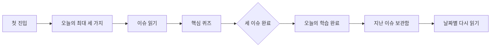
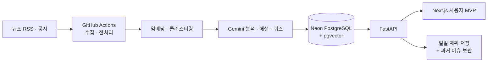

# 장독대 (JangDokDae)

> 뉴스가 너무 많아서 읽지 못하는 사람에게, 오늘 꼭 이해할 세 가지를 건넵니다.

장독대는 주식 입문자가 시장 뉴스를 **많이 소비하는 대신, 중요한 흐름을 이해하고 스스로 판단하도록 돕는 학습형 뉴스 서비스**입니다.

이 저장소는 팀 프로젝트로 시작한 장독대를 개인 프로젝트로 이어가며, 제품의 핵심 경험과 운영 품질을 다시 다듬은 기록입니다.

<p>
  <a href="https://github.com/jangdokdae990">팀 프로젝트 원본 프로필</a> ·
  <a href="https://github.com/jangdokdae990/jangdokdae-client-v2">팀 프론트엔드</a> ·
  <a href="https://github.com/jangdokdae990/jangdokdae-server">팀 백엔드</a> ·
  <a href="https://github.com/subeomsp/jangdokdae">개인 후속 프로젝트</a>
</p>

## 이 프로젝트를 다시 이어간 이유

팀 프로젝트를 마친 뒤에도 한 가지 질문이 남았습니다.

> 뉴스를 더 많이 모아 보여주는 것이 정말 초보자에게 도움이 될까?

기존 서비스는 수집, 분석, 해설, 용어, 퀴즈까지 많은 기능을 갖췄지만, 사용자가 매일 무엇을 먼저 이해해야 하는지는 여전히 어려운 문제였습니다. 뉴스 피드는 계속 늘어나지만 학습에는 끝이 없고, LLM이 만든 설명은 그럴듯해도 매번 같은 품질을 보장하기 어려웠습니다.

그래서 팀 프로젝트의 결과물을 단순히 기능 목록으로 남겨두지 않고, 다음 가설을 검증하는 개인 프로젝트로 이어갔습니다.

> 초보자에게 필요한 것은 더 많은 뉴스가 아니라, 믿을 수 있는 세 가지와 그것을 이해하고 끝낼 수 있는 짧은 흐름이다.

## 팀 프로젝트에서 개인 프로젝트로

| 구분 | 팀 프로젝트 | 개인 후속 프로젝트 |
| --- | --- | --- |
| 중심 질문 | 금융 뉴스를 수집하고 쉽게 설명하는 서비스를 어떻게 만들까? | 매일 무엇을 보여줘야 사용자가 실제로 이해를 끝낼까? |
| 제품 경험 | 뉴스 탐색, 이슈 상세, 용어, 퀴즈, 개인화 | 오늘의 세 가지 → 읽기 → 퀴즈 → 완료 → 지난 이슈 다시 읽기 |
| 데이터·AI | 수집·전처리·임베딩·클러스터링·LLM 분석 | 후보 평가, 일일 계획 고정, 품질 게이트, 회귀 평가 |
| 운영 | Airflow 중심의 파이프라인 | GitHub Actions 하루 1회 실행과 운영 데이터 보존 정책 |
| 결과물 | 팀이 함께 만든 서비스 기반 | 핵심 가치와 품질을 좁혀 검증한 개인 작업 기록 |

### 팀 프로젝트에서의 기여

원본 팀 프로젝트에서는 다음 영역을 맡았습니다.

- 뉴스·기업 데이터 수집 파이프라인 설계
- 데이터 전처리와 중복 제거
- 데이터베이스 설계 및 적재 구조
- 서버 CI/CD와 운영 환경 구성

팀 프로젝트의 전체 서비스 기획, 프론트엔드, 뉴스 분석, 인증 등은 네 명의 팀원이 함께 나누어 구현했습니다. 자세한 팀원별 역할과 원래의 전체 아키텍처는 [팀 프로젝트 원본 README](https://github.com/jangdokdae990/.github/blob/main/profile/README.md)에서 확인할 수 있습니다.

## 개인 프로젝트에서 중점적으로 둔 것

### 1. 피드를 학습의 끝이 있는 경험으로 바꾸기

모든 이슈를 보여주는 대신 하루에 최대 세 가지 역할을 둡니다.

1. 가장 먼저 이해할 핵심 이슈
2. 개별 뉴스 너머의 시장 맥락
3. 익숙한 관심사 밖의 시야 넓히기

각 이슈를 읽고 핵심 퀴즈를 제출하면 그날의 학습이 끝납니다. 좋은 후보가 세 개보다 적으면 빈자리를 억지로 채우지 않습니다. 그래서 화면의 문구도 실제 이슈 수에 맞춰 `한 가지`, `두 가지`, `세 가지`로 바뀝니다. 이 선택은 기능을 줄인 것이 아니라, 사용자의 주의를 제품의 중심 제약으로 삼은 결정입니다.

### 2. LLM의 그럴듯함보다 근거와 검증을 우선하기

생성 결과를 바로 노출하지 않고 다음 단계를 분리했습니다.

- 원문 출처와 근거를 화면에 함께 표시
- 한국은행 「경제금융용어 800선」 원문을 기반으로 용어 설명 생성
- 용어 분리와 쉬운 설명을 사람 검수 가능한 상태로 관리
- 품질이 낮거나 설명이 얕은 후보는 일일 계획에서 제외
- 작은 골드셋과 회귀 평가로 변경 전후를 비교

목표는 “AI가 많이 생성한다”가 아니라, **사용자가 믿고 읽을 수 있는 콘텐츠만 남기는 것**이었습니다.

화면에서는 이 원칙을 `주린이 필터`로 드러냅니다. 이슈를 열면 먼저 “이 소식을 어떤 질문으로 읽어야 하는가”를 보여주고, 각 해설 카드에도 초보자가 확인해야 할 기준을 붙입니다. 단순한 요약문을 나열하는 대신, 뉴스의 사실·영향·가정·다음에 볼 지표를 따라가며 읽도록 안내하는 방식입니다.

### 3. 같은 날짜에는 같은 학습을 보장하기

파이프라인이 오후에 다시 실행되더라도 이미 학습을 시작한 사용자의 오늘 세 이슈가 바뀌지 않도록 일일 계획을 DB에 저장했습니다. 이 결정으로 개인화보다 재현성과 사용자 신뢰를 우선했습니다.

### 4. 과거의 학습도 다시 이어지게 하기

오늘의 학습만 만들고 끝내지 않도록, 오늘을 제외한 최근 14일의 이슈를 날짜별로 다시 볼 수 있는 보관함을 추가했습니다. 과거 이슈는 퀴즈를 강제하지 않고 읽기 전용으로 제공해 탐색 흐름을 가볍게 유지했습니다.

## 현재 사용자 흐름



## 결과와 검증

| 검증 항목 | 결과 | 의미 |
| --- | ---: | --- |
| 서버 테스트 | `312 passed` | API·선택·용어·파이프라인 로직의 회귀 확인 |
| 일일 선택 v4 수용 평가 | `29/29` | 최근 실제 선택 항목에 대한 사용자 수용 확인 |
| 용어 설명 회귀 평가 | `102/102` | 34개 골드 Task를 3회 반복한 작은 품질 게이트 |
| 일일 계획 | 날짜별 DB 저장 | 파이프라인 재실행에도 당일 학습 고정 |
| 과거 콘텐츠 | 최근 14일 보관 | 오늘 이후의 재방문 경로 제공 |

위 수치는 전체 뉴스 품질을 증명하는 통계가 아니라, 변경을 안전하게 판단하기 위한 작은 회귀·수용 평가입니다. 개인 프로젝트에서는 숫자를 크게 보이게 만드는 것보다 **무엇을 측정했고 무엇은 아직 모르는지 구분하는 것**을 중요하게 생각했습니다.

## 아키텍처



주요 설계 문서:

- [일일 학습 MVP 설계](jangdokdae-server/docs/design/16-daily-learning-mvp.md)
- [일일 선택 기준과 평가](jangdokdae-server/docs/design/17-daily-selection-criteria.md)
- [GitHub Actions 운영 전환 가이드](jangdokdae-server/docs/guide/02-github-actions-new-environment-setup.md)
- [한국은행 원문 기반 용어사전 운영 가이드](jangdokdae-server/docs/guide/03-bok-inline-glossary.md)

## 기술 스택

| 영역 | 사용 기술 |
| --- | --- |
| 사용자 앱 | Next.js 16, React 19, TypeScript |
| API | Python 3.12, FastAPI, SQLAlchemy, Alembic |
| 데이터 | PostgreSQL, Neon, pgvector |
| AI·ML | Vertex AI Gemini, LangChain, 임베딩, UMAP, HDBSCAN |
| 운영 | GitHub Actions, Workload Identity Federation |
| 품질 | pytest, Ruff, ESLint, TypeScript 검사, 골드셋 회귀 평가 |

기술 선택 자체보다, 각 기술을 제품 문제에 연결한 방식과 그 결과를 설명하는 것을 이 프로젝트의 핵심으로 두었습니다.

## 로컬에서 실행하기

서버:

```bash
cd jangdokdae-server
uv sync --frozen --extra dev
uv run alembic upgrade head
uv run uvicorn app.main:app --reload
```

프론트:

```bash
cd jangdokdae-web
cp .env.example .env.local
npm ci
npm run dev
```

브라우저에서 <http://localhost:3000>을 열면 오늘의 세 가지를 읽고 퀴즈를 푼 뒤, 최근 14일의 지난 이슈까지 다시 볼 수 있습니다.

검증 명령:

```bash
# server
cd jangdokdae-server
uv run python -m pytest -q
uv run ruff check .

# web
cd jangdokdae-web
npm run lint
npm run typecheck
npm run build
```

## 현재의 한계

- 공개 운영 URL과 데모 환경은 별도로 관리되므로 로컬 실행 설정을 함께 제공합니다.
- 일일 선택·용어 평가는 작은 골드셋 기반이며, 전체 789개 용어의 자동 승인을 의미하지 않습니다.
- 과거 이슈는 현재 최근 14일까지만 제공합니다.
- 실제 사용자 수와 장기 리텐션을 측정한 단계는 아닙니다.

이 한계를 숨기기보다, 다음 개선의 기준으로 남겨두었습니다. 개인 프로젝트에서 중요하게 본 것은 기능의 개수가 아니라 **문제를 정의하고, 선택한 범위를 검증하고, 남은 불확실성을 설명하는 능력**이었습니다.

## 라이선스

MIT
