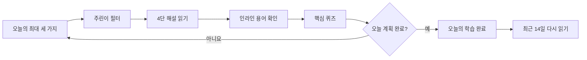
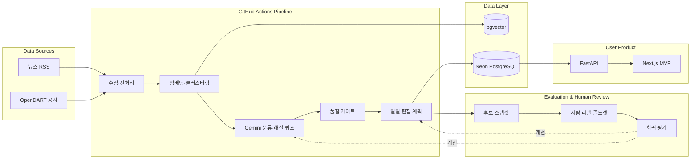

# 장독대 | JangDokDae

> 주식 입문자가 넘치는 금융 뉴스 속에서 오늘 이해해야 할 흐름을 놓치지 않도록,<br>
> AI로 뉴스를 해석하고 규칙·평가 시스템으로 **하루 최대 세 가지 학습**만 제공하는 서비스입니다.

[팀 프로젝트 원본](https://github.com/jangdokdae990) · [원본 Client](https://github.com/jangdokdae990/jangdokdae-client-v2) · [원본 Server](https://github.com/jangdokdae990/jangdokdae-server) · [개인 후속 프로젝트](https://github.com/subeomsp/jangdokdae)

| 항목 | 내용 |
| --- | --- |
| **Problem** | 초보 투자자는 뉴스의 양보다 용어·맥락·판단 기준의 부재 때문에 시장을 읽기 어렵다. |
| **User** | 금융 뉴스를 어디서부터 어떻게 읽어야 할지 막막한 주식 입문자 |
| **Approach** | 뉴스 피드를 `오늘의 최대 세 가지 → 해설 → 퀴즈 → 완료` 학습 흐름으로 전환 |
| **AI Role** | 비정형 뉴스의 투자 관련성·프레임 판단, 초보자용 해설·퀴즈 생성, 후보의 편집 가치 판정 |
| **System Role** | 수집·중복 제거·후보 제한·품질 게이트·일일 계획 저장·진행 상태·출처 검증 |
| **My Role** | 팀 단계의 데이터 파이프라인·DB·서버 운영, 이후 개인 단계의 제품 재정의·AI 평가·운영 자동화·MVP 구현 |
| **Status** | 개인 후속 MVP · 자동 파이프라인 및 DB 운영 이력 보유 · 공개 데모 URL 별도 관리 |

이 저장소는 팀 프로젝트로 만든 장독대를 그대로 복제한 결과물이 아닙니다. 팀 종료 후 “기능은 많지만 사용자가 매일 무엇을 이해해야 하는지는 여전히 어렵다”는 문제를 다시 정의하고, 제품 범위를 줄이면서 AI 품질과 운영 재현성을 높인 개인 후속 프로젝트입니다.

---

## 01. Problem

### Target User

장독대의 사용자는 뉴스가 부족한 사람이 아니라, 뉴스는 많이 접하지만 다음 질문에 답하기 어려운 주식 입문자입니다.

- 이 뉴스가 왜 중요한가?
- 숫자가 올랐다는 사실을 어떻게 해석해야 하는가?
- 기사 속 전망과 확정된 사실은 무엇이 다른가?
- 어려운 금융 용어를 어디까지 알아야 하는가?
- 오늘 수많은 뉴스 중 무엇부터 읽어야 하는가?

### Current Workflow

```text
뉴스·유튜브·커뮤니티를 계속 탐색
        ↓
제목과 수치 중심으로 정보를 단편적으로 소비
        ↓
용어와 시장 맥락에서 이해가 막힘
        ↓
전망과 사실을 구분하지 못한 채 다른 해설을 다시 탐색
        ↓
읽기는 계속되지만 학습은 끝나지 않음
```

### Pain Point

| 문제 | 사용자에게 생기는 결과 |
| --- | --- |
| 뉴스 과잉 | 중요한 이슈를 고르는 데 더 많은 시간을 쓴다. |
| 독해 기준 부재 | 사실·영향·가정·후속 지표를 구분하지 못한다. |
| 어려운 금융 용어 | 내용을 이해하기 전에 검색과 이탈이 반복된다. |
| 생성형 AI의 품질 편차 | 자연스러운 문장과 신뢰할 수 있는 설명을 구분하기 어렵다. |
| 완료 기준 부재 | 얼마나 읽어야 충분한지 알 수 없다. |

### Problem Definition

> 문제는 금융 뉴스의 수가 부족한 것이 아니라, 초보자가 **무엇을 어떤 기준으로 읽고 어디에서 학습을 끝내야 하는지** 알기 어렵다는 점이다.

---

## 02. Approach

### 2.1 Problem Decomposition

큰 문제를 하나의 LLM 호출로 해결하지 않고, 서로 다른 책임을 가진 다섯 단계로 나눴습니다.

| 세부 문제 | 필요한 처리 |
| --- | --- |
| 비슷한 기사가 반복 노출됨 | URL·제목 중복 제거, 임베딩·클러스터링 |
| 투자와 무관한 기사도 섞임 | 의미 기반 관련성·프레임 분류 |
| 초보자가 기사 구조를 읽기 어려움 | 프레임별 질문에 맞춘 4단 해설과 `주린이 필터` |
| 좋은 콘텐츠를 매일 고르기 어려움 | AI 편집 판정 + 점수·중복·역할 규칙 |
| 생성 결과를 그대로 믿기 어려움 | 출처 연결, 품질 게이트, 골드셋 회귀, 사람 승인 |

### 2.2 Why AI / Why Not AI

AI는 비정형 의미를 해석하고 설명을 만드는 데 사용했습니다. 반대로 개수 제한, 데이터 정합성, 승인 상태처럼 결과가 항상 같아야 하는 판단은 규칙과 백엔드가 담당합니다.

| Task | AI | Rule / System / Human | 이유 |
| --- | :---: | :---: | --- |
| 뉴스의 투자 관련성·프레임 판단 | ✓ | 품질 조건 보완 | 문장 맥락과 표현의 다양성을 해석해야 함 |
| 초보자용 해설·퀴즈 생성 | ✓ | 금지 표현·빈 답변 게이트 | 기사마다 설명 구조와 표현이 달라짐 |
| 후보의 학습 가치·역할 적합도 판정 | ✓ | 점수·중복·신선도 규칙 | 의미적 가치와 일별 구성 조건을 함께 봐야 함 |
| 하루 최대 세 개 제한 |  | ✓ | 제품 정책은 결정론적으로 유지해야 함 |
| 같은 날짜의 계획 고정 |  | ✓ | 재실행에도 동일한 사용자 경험이 필요함 |
| 용어 원문·승인 상태 관리 |  | ✓ | 공식 출처와 검수 상태를 추적해야 함 |
| 평가 정답과 최종 승인 |  | Human ✓ | 모델이 자신의 결과를 최종 정답으로 확정하지 않도록 함 |

전체 과정을 LLM에 맡기지 않은 이유는 분명합니다. LLM은 “이 뉴스가 어떤 의미인가”에는 유용하지만, “몇 개를 노출할지”, “승인되지 않은 용어를 보여줄지”, “같은 날짜에 어떤 계획을 유지할지”까지 결정하게 하면 재현성과 통제가 약해집니다.

### 2.3 Solution Hypothesis

```text
Before
많은 뉴스 탐색 → 개별 기사 요약 → 계속 스크롤

After
오늘의 최대 세 가지 선택
→ 주린이 필터로 읽을 질문 제시
→ 사실·영향·가정·후속 지표 순서로 해설
→ 핵심 퀴즈로 이해 확인
→ 오늘의 학습 완료
→ 필요할 때 지난 이슈 다시 읽기
```

가설은 단순합니다.

> 콘텐츠의 양을 늘리는 대신 선택의 기준과 학습의 끝을 제공하면, 초보자가 뉴스를 소비하는 데서 시장을 읽는 연습으로 이동할 수 있다.

---

## 03. How It Works

### 3.1 User Flow

좋은 후보가 세 개보다 적으면 실제 개수만 제공합니다. 따라서 홈의 문구도 `한 가지`, `두 가지`, `세 가지`로 실제 계획에 맞춰 바뀝니다.


```mermaid
flowchart LR
    A[오늘의 최대 세 가지] --> B[주린이 필터]
    B --> C[4단 해설 읽기]
    C --> D[인라인 용어 확인]
    D --> E[핵심 퀴즈]
    E --> F{오늘 계획 완료?}
    F -- 아니요 --> A
    F -- 예 --> G[오늘의 학습 완료]
    G --> H[최근 14일 다시 읽기]
```

`주린이 필터`는 단순한 문체 변환이 아닙니다. 이슈마다 먼저 풀어야 할 질문을 제시하고, 프레임에 따라 다음과 같은 독해 순서를 제공합니다.

```text
무슨 일이 있었는가
→ 누구에게 어떤 영향을 주는가
→ 어떤 가정이 맞아야 하는가
→ 앞으로 무엇을 확인해야 하는가
```

### 3.2 System Architecture


```mermaid
flowchart LR
    subgraph Sources[Data Sources]
        RSS[뉴스 RSS]
        DART[OpenDART 공시]
    end

    subgraph Pipeline[GitHub Actions Pipeline]
        COLLECT[수집·전처리]
        EMBED[임베딩·클러스터링]
        ANALYZE[Gemini 분류·해설·퀴즈]
        GATE[품질 게이트]
        PLAN[일일 편집 계획]
    end

    subgraph Data[Data Layer]
        DB[(Neon PostgreSQL)]
        VECTOR[(pgvector)]
    end

    subgraph Product[User Product]
        API[FastAPI]
        WEB[Next.js MVP]
    end

    subgraph Evaluation[Evaluation & Human Review]
        SNAPSHOT[후보 스냅샷]
        GOLD[사람 라벨·골드셋]
        REGRESSION[회귀 평가]
    end

    RSS --> COLLECT
    DART --> COLLECT
    COLLECT --> EMBED
    EMBED --> VECTOR
    EMBED --> ANALYZE
    ANALYZE --> GATE
    GATE --> PLAN
    PLAN --> DB
    DB --> API
    API --> WEB
    PLAN --> SNAPSHOT
    SNAPSHOT --> GOLD
    GOLD --> REGRESSION
    REGRESSION -. 개선 .-> ANALYZE
    REGRESSION -. 개선 .-> PLAN
```

### 3.3 AI / Data Pipeline

```text
Raw News
→ 신선도·중복 전처리                      [Rule]
→ 임베딩·HDBSCAN 이슈 클러스터링          [Algorithm]
→ 투자 관련성·프레임 분류                 [AI]
→ 4단 해설·hook·용어 span·퀴즈 생성       [AI]
→ 빈 답변·근거·검수 필요 여부 확인         [Rule]
→ 후보별 학습 가치·역할 적합도 판단        [AI]
→ 중복·신선도·역할 조합으로 최대 3개 선택  [Rule]
→ 날짜별 일일 계획 저장                    [Backend]
→ 사람 라벨과 회귀 평가                    [Human + Evaluation]
```

모델의 출력은 구조화된 데이터로 저장하고, API는 승인된 결과만 사용자 화면에 전달합니다. 같은 날짜의 일일 계획은 DB에 고정해 파이프라인 재실행이 사용자 학습 중간에 결과를 바꾸지 않도록 했습니다.

---

## 04. Decisions & Validation

### 4.1 Key Decisions

| 고민 | 선택 | 이유 | Trade-off |
| --- | --- | --- | --- |
| 매일 반드시 세 개를 채울 것인가 | 좋은 후보가 부족하면 1~2개만 제공 | 근거 없는 빈자리 콘텐츠보다 신뢰가 중요함 | 어떤 날은 화면이 덜 풍성해 보임 |
| 선택을 LLM에 전부 맡길 것인가 | AI 판정 + 결정론적 조합 규칙 | 의미 판단과 정책 통제를 분리 | 평가·규칙 코드가 함께 필요함 |
| 개인화를 우선할 것인가 | 승인된 일일 계획 안에서만 제한적으로 재배열 | 관심사 때문에 품질 미달 후보가 올라오는 것을 방지 | 사용자별 차이가 작아짐 |
| 용어 설명을 자유 생성할 것인가 | 한국은행 원문 + 사람 승인 + 검증 상태 | 출처와 설명의 책임 범위를 추적 가능 | 전체 용어를 빠르게 커버하기 어려움 |
| 일일 계획을 요청마다 다시 계산할 것인가 | 날짜별 계획을 DB에 저장 | 재현성, 비용 통제, 사용자 경험 고정 | 최신 후보가 당일 중간에 즉시 반영되지 않음 |
| 개인 환경에서 Airflow를 계속 운영할 것인가 | GitHub Actions 하루 1회로 전환 | 노트북 상시 실행 없이 비용과 운영 복잡도 축소 | 복잡한 스케줄링·관측 기능은 줄어듦 |

### 4.2 Evaluation Metrics

| Metric | Result | 해석 범위 |
| --- | ---: | --- |
| 서버 회귀 테스트 | `312 passed` | API·파이프라인·선택·용어 로직 |
| 기존 휴리스틱의 사람 선택 일치율 | `18.2%` | 11일 라벨 기준 초기 기준선 |
| v3 선택 일치율 | `33.3%` | LLM 판정과 조합 규칙 적용 후 |
| v3 사용자 수용률 | `84.8% (28/33)` | 선택 결과를 실제로 받아들일 수 있는지 검토 |
| v4 사용자 수용률 | `100% (29/29)` | 무전개 반복·발견 깊이 게이트 보정 후 |
| 용어 설명 회귀 평가 | `102/102`, 평균 `95.78점` | 34개 골드 Task × 3회 반복 |
| 프론트 검증 | lint · typecheck · build 통과 | Next.js MVP 정적 품질 검사 |

이 수치는 서비스 전체 품질이나 장기 사용자 효과를 증명하지 않습니다. 작은 골드셋과 수용 평가 안에서 변경 전후의 회귀를 확인하는 용도로 사용했습니다.

### 4.3 Representative Failure & Improvement

#### Failure 01 — 점수는 높지만 학습 가치가 낮은 반복 이슈

```text
문제
같은 사건의 후속 전개가 없는 기사와 설명이 얕은 발견 후보가 다시 선택됨

원인
중요도·신선도 점수만으로는 의미적 반복과 독해 깊이를 충분히 구분하지 못함

개선
최근 7일 실제 선택과 비교하는 무전개 반복 게이트
+ discovery 역할의 설명 깊이 조건 추가

결과
v3 수용률 84.8% → v4 검토 29/29 수용
```

#### Failure 02 — 공식 원문을 사용해도 검증기가 문맥을 잘못 판단함

```text
문제
열거형 정의, 지수·비율형 용어, 여러 조건이 결합된 설명에서 오탐·누락 발생

원인
단순 문자열 포함 여부와 단일 점수만으로 핵심 개념 보존을 판단

개선
required concept group 회귀 조건 추가
+ 원문 근거와 설명 완전성을 분리 평가
+ 실패 피드백을 넣은 1회 자동 보정

결과
bok-definition-v6 기준 34 Task × 3회, 102/102 통과
```

실패를 프롬프트 예외 문장 하나로 덮지 않고, 사람 판정이 맞는지 먼저 확인한 뒤 코드 규칙·프롬프트 규칙·골드 회귀 사례로 나누어 반영했습니다.

자세한 근거는 [일일 선택 기준](jangdokdae-server/docs/design/17-daily-selection-criteria.md)과 [용어 평가 결과](jangdokdae-server/docs/evaluation/results/dictionary-definition-eval-2026-07-28-041131-aggregate.md)에서 확인할 수 있습니다.

---

## 05. Scope & Learnings

### 5.1 What I Actually Built

#### Team Project

원본 장독대는 네 명이 함께 만든 팀 프로젝트입니다. 전체 서비스 기획, 프론트엔드, 뉴스 분석, 인증을 팀원들이 나누어 구현했습니다.

팀 단계에서 제가 담당한 범위는 다음과 같습니다.

- 뉴스·기업 데이터 수집 파이프라인 설계
- 데이터 전처리와 중복 제거
- 데이터베이스 설계 및 적재 구조
- 서버 CI/CD와 운영 환경 구성

팀원별 전체 역할은 [원본 팀 README](https://github.com/jangdokdae990/.github/blob/main/profile/README.md)에 공개되어 있습니다.

#### Personal Continuation

팀 종료 후 이 저장소에서 직접 이어간 범위입니다.

- 뉴스 피드를 `하루 최대 세 가지` 학습 경험으로 재정의
- 오늘 학습·읽기·퀴즈·완료·최근 14일 보관함 MVP 구현
- `주린이 필터`, 인라인 용어 설명, 출처 표시 UX 구현
- 일일 후보 스냅샷·사람 라벨·LLM 판정·선택 회귀 평가 구축
- v4 일일 계획 생성·DB 저장·API 연동
- 한국은행 원문 기반 용어 분리·설명·검수·회귀 평가 구축
- Airflow 중심 운영을 GitHub Actions 정기 실행으로 전환
- Neon 마이그레이션, 데이터 보존·정리 정책, 운영 가이드 작성

### 5.2 Limitations

- 일일 선택 평가는 11일의 작은 라벨셋을 사용했습니다.
- 용어 회귀 평가는 789개 전체가 아니라 사람 승인된 34개 Task를 대상으로 합니다.
- 실제 사용자 수, 학습 효과, 장기 리텐션을 측정하지 않았습니다.
- 지난 이슈는 최근 14일까지만 제공합니다.
- 공개 프론트·API URL과 자동 배포 상태는 저장소에 정본으로 고정하지 않았습니다.
- Render 무료 티어 환경에서는 콜드스타트가 발생할 수 있습니다.

### 5.3 Production Considerations

실제 서비스로 확장하려면 다음 검증이 추가로 필요합니다.

| 영역 | 필요한 작업 |
| --- | --- |
| User Validation | 초보 투자자의 이해도·완료율·재방문율 측정 |
| Observability | 파이프라인 실패, LLM 호출 수·비용, 후보 부족, API 지연 모니터링 |
| Model Quality | 신규 실패 사례 자동 수집과 사람 승인 기반 회귀 파이프라인 |
| Data Governance | 뉴스 보존 기간, 원문 저작권, 사용자 활동 데이터 정책 명시 |
| Reliability | 프론트·API 배포 체크, E2E smoke test, 콜드스타트 대응 |
| Security | 운영 CORS, HTTPS 쿠키, OAuth callback, 비밀값 회전 검증 |

### 5.4 Learnings

> AI 기능을 더 많이 넣는 것보다, AI가 판단할 영역과 시스템이 통제할 영역의 경계를 정하는 것이 더 중요했습니다.

이 프로젝트를 개인적으로 이어가며 얻은 가장 큰 학습은 세 가지입니다.

1. 사용자 문제를 기능 부족으로 해석하면 제품은 계속 커지지만, 핵심 행동은 선명해지지 않습니다.
2. 생성 품질은 좋은 예시 몇 개가 아니라 실패 사례를 보존하고 다시 실행할 수 있을 때 개선됩니다.
3. 개인 프로젝트의 운영에서는 복잡한 도구보다 실제로 매일 실행되고 복구 가능한 구조가 더 가치 있습니다.

결과적으로 장독대에서 보여주고자 한 것은 특정 모델이나 프레임워크의 사용 경험만이 아닙니다. 모호한 사용자 문제를 구조화하고, AI·규칙·사람의 책임을 나누고, 실제 MVP와 평가 시스템으로 연결하는 과정입니다.

---

## Repository

```text
.
├── jangdokdae-server/   # FastAPI, 데이터·LLM 파이프라인, 평가, 마이그레이션
├── jangdokdae-web/      # Next.js 오늘 학습·퀴즈·지난 이슈 MVP
├── .github/workflows/   # 매일 08:30 KST 뉴스 파이프라인
└── README.md            # AX Case Study
```

주요 문서:

- [일일 학습 MVP 설계](jangdokdae-server/docs/design/16-daily-learning-mvp.md)
- [일일 선택 기준과 평가](jangdokdae-server/docs/design/17-daily-selection-criteria.md)
- [GitHub Actions 운영 전환](jangdokdae-server/docs/guide/02-github-actions-new-environment-setup.md)
- [한국은행 원문 기반 용어사전](jangdokdae-server/docs/guide/03-bok-inline-glossary.md)

## Run Locally

### Server

```bash
cd jangdokdae-server
uv sync --frozen --extra dev
uv run alembic upgrade head
uv run uvicorn app.main:app --reload
```

### Web

```bash
cd jangdokdae-web
cp .env.example .env.local
npm ci
npm run dev
```

브라우저에서 <http://localhost:3000>을 엽니다.

### Validation

```bash
# server
cd jangdokdae-server
uv run python -m pytest -q
uv run ruff check .

# web
cd jangdokdae-web
npm run lint
npm run typecheck
npm run build
```

## License

MIT
