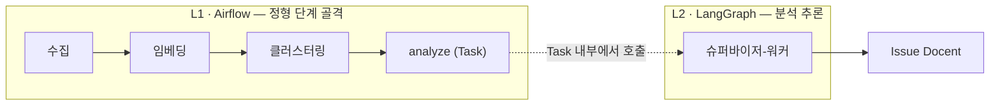
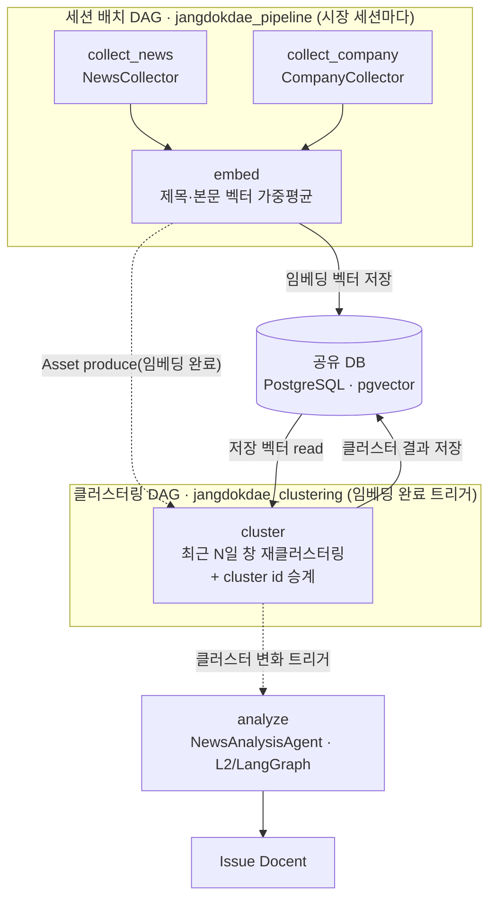
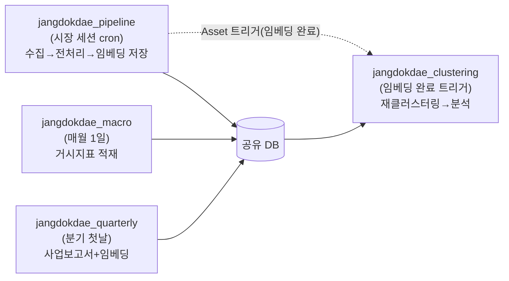
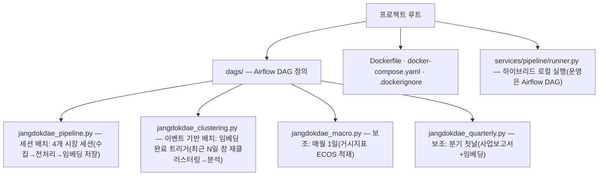

# Airflow 워크플로우 오케스트레이션

> **작성자** Kim minkyoung · **작성일** 2026-06-08 (2026-06-18 재설계 개정 · 2026-06-19 설계 리뷰 보강)
>
> **범위** 장독대 파이프라인의 **실행 골격 설계** — 각 단계를 Airflow와 LangGraph 중 어디에 배치하는가([기획])와, 그것을 어떤 DAG 구조로 구현하는가([설계]).
>
> **Airflow 자체의 개념·구성요소·스케줄링·설치·배포·아키텍처는 [Airflow 핵심 개념 가이드](../guide/00-airflow-essentials.md)가 단일 출처다.** 본 문서는 그 배경지식을 전제하고 **장독대 적용 설계만** 다룬다.

---

## 2계층 오케스트레이션 모델

장독대의 자동화는 **성격이 다른 두 종류의 오케스트레이션**으로 나뉜다.

| 계층 | 도구 | 책임 | 문서 |
|------|------|------|------|
| **L1 파이프라인 오케스트레이션** | Airflow | 정형 단계(수집~클러스터링)의 자동 연결·스케줄·재시도·관찰성 | **본 문서** |
| **L2 AI 에이전트 오케스트레이션** | LangGraph (슈퍼바이저-워커) | 분석→Issue Docent 단계 *내부*의 멀티 에이전트 추론·협업 | [06 §18](./06-news-analysis-design.md#18-newsanalysisagent-설계) |

- **L1 = 자동화(automation)**: "다음에 무엇을 할지"가 고정돼 있다.
- **L2 = 에이전트(agent)**: "다음에 무엇을 할지"를 LLM이 판단한다. **분석 단계 한 곳에만** 존재한다.
- 두 계층은 경쟁이 아니라 **맞물린다** — Airflow가 바깥 골격(언제·어떤 순서로)을 잡고, **`analyze` Task 하나가 그 내부에서 LangGraph 슈퍼바이저를 호출**한다. "바깥 골격 + 내부 두뇌".



> L1은 다시 **시장 세션 기반 수집·임베딩 배치**와 **이벤트 기반 클러스터링 배치**로 분리된다(2026-06-18 재설계 → [7장](#7-dag-구성)·[12장](#12-이전-접근--변경-이력)). 클러스터링은 더 이상 세션 run 안에서 이어지지 않고, 저장된 임베딩 벡터만 읽되 **임베딩이 새 벡터를 적재할 때 트리거되어** 독립 실행된다.

## 목차

**[기획] — 무엇을 어디에 배치하는가**

- [1. 왜 Airflow인가](#1-왜-airflow인가)
- [2. 경계 기준 — 흐름 제어(Flow Control)](#2-경계-기준--흐름-제어flow-control)
- [3. 두 도구의 강점과 한계](#3-두-도구의-강점과-한계)
- [4. 파이프라인 단계 배치 매핑](#4-파이프라인-단계-배치-매핑)
- [5. 경계 케이스 해설](#5-경계-케이스-해설)

**[설계] — 어떻게 구현하는가**

- [6. 전체 구조](#6-전체-구조)
- [7. DAG 구성](#7-dag-구성)
- [8. DAG 구현](#8-dag-구현)
- [9. 파이프라인 러너 (하이브리드 로컬 실행)](#9-파이프라인-러너-하이브리드-로컬-실행)
- [10. 디렉토리 구조](#10-디렉토리-구조)
- [11. 배포·실행 환경](#11-배포실행-환경)
- [12. 이전 접근 · 변경 이력](#12-이전-접근--변경-이력)

---

# [기획]

> **왜 하는가 · 무엇을 만들 것인가.** 파이프라인의 각 단계를 **Airflow와 LangGraph 중 어디에 배치하는지**와 **그 판단 기준**을 명문화한다. 멘토 피드백 핵심 질문 — **"컴포넌트 각각의 한계점을 명확히 정의했는가?"**([2026-06-02 피드백 1-1](../mentoring/2026-06-02-feedback.md))에 대한 직접 답이다.

## 1. 왜 Airflow인가

장독대 파이프라인 대부분은 **정해진 주기로 도는 정형 작업**이다 — 필요한 것은 스케줄링(시장 세션 배치 + 이벤트 기반 클러스터링), 의존성·병렬, 선언적 재시도, 실행 이력(observability)이다. 이 영역의 특화 도구가 Airflow다. (cron·APScheduler로는 왜 부족한지는 [가이드 §1](../guide/00-airflow-essentials.md#1-왜-airflow인가--cron으로는-부족한-순간) 참조.)

같은 "파이썬 스케줄러"인 APScheduler와 비교하면 차이가 분명하다.

| 항목 | APScheduler | **Airflow** |
|------|------------|------------|
| 실행 이력 UI | 없음 | 있음(Web UI — 성공/실패/소요 시간) |
| 재시도 정책 | 수동 구현 | `retries`·`retry_delay` 선언적 |
| 태스크 병렬·의존성 | 직접 코딩 | DAG 의존성으로 자동 처리 |
| 분산 실행 | 없음 | Executor 교체로 스케일아웃 |
| 서버 재시작 후 | 스케줄 유실 | 메타데이터 DB 기반으로 유지 |

**둘은 경쟁이 아니라 계층이다** — Airflow가 바깥 골격(언제·어떤 순서로)을 잡고, 추론이 필요한 Task **내부**에서 LangGraph가 동작한다.

## 2. 경계 기준 — 흐름 제어(Flow Control)

경계 기준은 **"LLM을 쓰느냐"가 아니라 "다음 단계로 갈 흐름을 LLM 판단으로 정하느냐"**다.

| 질문 | 예 → 배치 |
|------|----------|
| 다음에 무엇을 할지가 **LLM의 추론**으로 갈린다 (분기·반복) | **LangGraph** |
| 입력 → 출력이 고정, 분기가 있어도 **정적** (schedule, 고정 규칙) | **Airflow Task** |

따라서 **정형 LLM 호출은 LangGraph가 아니다** — 임베딩 API, 고정 스키마 엔티티 추출은 LLM을 쓰더라도 흐름이 정적이므로 Airflow Task다.

## 3. 두 도구의 강점과 한계

멘토 핵심 질문("컴포넌트 각각의 한계를 정의했는가")에 대한 직접 답 — **못하는 것**을 명시한다.

| | Airflow | LangGraph |
|---|---------|-----------|
| **잘하는 것** | 스케줄링, 재시도 정책, 실행 이력 UI, DAG 의존성·병렬, 분산 실행 | LLM 기반 동적 흐름 제어, 조건부 분기, 상태 누적, 추론 루프 |
| **못하는 것** | LLM 판단 **동적 흐름·추론 루프** 불가 — 분기는 정적 분기만 | 스케줄링·재시도 이력·파이프라인 **observability** 없음. cron·catchup 부재 |
| **그래서** | 정형 단계의 **실행 골격** | 추론 단계의 **내부 두뇌** |

## 4. 파이프라인 단계 배치 매핑

CLAUDE.md 파이프라인 `수집 → 전처리 → 임베딩·클러스터링 → 엔티티 추출 → 분석 → Issue Docent` 전 단계를 [2장 기준](#2-경계-기준--흐름-제어flow-control)에 따라 배치한다.

| # | 단계 | 배치 | 흐름제어에 LLM 추론? | 근거 |
|---|------|------|:---:|------|
| 1 | **뉴스 수집** | Airflow Task (세션 배치) | 아니오 | `collect → save` **정적 순차**. 클러스터링·스코어링은 별도 이벤트 기반 배치로 분리 (→ [5.2](#52-뉴스-수집-정적-순차--airflow-task로-교정)·[7.2](#72-클러스터링-dag--이벤트-기반-배치-데이터-도착-트리거)) |
| 2 | **기업 수집** | Airflow Task (세션 배치) | 아니오 | `schedule`(morning/afternoon/macro/quarterly) 분기는 **정적**, API 호출 입출력 고정 (→ [5.1](#51-기업-수집-langgraph--airflow-task로-교정)) |
| 3 | **전처리** | Airflow Task (세션 배치) | 아니오 | 본문 정제(trafilatura fetch 후 폐기)·타임존 정규화·중복 제거 = **고정 규칙**, 분기 없음 |
| 4 | **임베딩** | Airflow Task (세션 배치) | 아니오 | 임베딩 API 호출(제목·본문 벡터 가중평균). 수집 시점에 미리 추론해 **벡터 저장**, 입력→출력 고정 (모델은 bake-off로 결정 → [12장](#12-이전-접근--변경-이력)) |
| 5 | **클러스터링·스코어링** | Airflow Task (이벤트 기반 배치) | 아니오 | 저장 벡터로 최근 N일 창을 **임베딩 완료 트리거 시** 재클러스터링 + 복합 중요도 스코어. 결정적·정형, 분기 없음. 수집·임베딩과 **분리된 독립 DAG** (→ [7.2](#72-클러스터링-dag--이벤트-기반-배치-데이터-도착-트리거)) |
| 6 | **엔티티 추출** | Airflow Task | 아니오 | **정형 LLM 호출** — 고정 스키마 추출. LLM을 쓰지만 흐름 분기 없음 |
| 7 | **분석 → Issue Docent** | LangGraph | 예 | 데이터 충분성 판단, RAG 엣지케이스 분기, 재시도·보강 루프. 다음 행동이 LLM 판단으로 갈림 |

> 6번 **엔티티 추출**이 핵심 경계 사례다. LLM을 호출하지만 "입력 → 고정 스키마 출력"이라 **흐름이 정적** → Airflow Task. "LLM = LangGraph"가 아님을 보여주는 대표 케이스.

## 5. 경계 케이스 해설

과거 LangGraph로 설계됐다가 [2장 기준](#2-경계-기준--흐름-제어flow-control)으로 Airflow Task로 교정한 두 사례 — 기준은 항상 "다음 행동을 LLM 추론으로 정하는가"다.

### 5.1 기업 수집: LangGraph → Airflow Task로 교정

`schedule`(morning/afternoon/macro/quarterly) 라우팅은 LLM 추론이 아니라 **사전 정의된 정적 분기**이고 각 수집기 호출도 입출력 고정 → Airflow Task. 01의 State·노드 구성은 논리 단위로는 유효하되, 실행 골격은 Airflow Task 그룹이다.

### 5.2 뉴스 수집: 정적 순차 → Airflow Task로 교정

과거 `collect → cluster → score → finalize` 그래프 설계에서 — 클러스터·스코어는 클러스터(기사 그룹) 단위 평가라 **클러스터링 단계(05)의 몫**으로 분리하고, NewsCollector는 `collect → save` 수집 전용으로 단순화했다. 분리 후 남는 연산도 전부 결정적이라 Airflow Task. (과거의 "부족하면 추가 검색 루프" 근거는 설계에 없는 가공의 루프라 폐기.)

---

# [설계]

> **어떻게 구현할 것인가.** [기획]에서 정한 배치 기준을 실제 Airflow DAG·실행 구조로 구체화한다.

## 6. 전체 구조

수집·임베딩은 **시장 세션 배치 DAG**가, 클러스터링은 **이벤트 기반 배치 DAG**가 맡는다. 두 DAG는 직접 통신하지 않고 **공유 DB(PostgreSQL/pgvector)의 상태 핸드오프로만** 데이터를 주고받되, 클러스터링 DAG는 임베딩 Task가 produce하는 Asset을 consume해 **임베딩 완료 시 트리거**된다.



**핵심 원칙**

- 단계끼리 직접 호출하지 않고 **공유 DB 상태 핸드오프**로만 전달(→ [01 §2](./01-pipeline-orchestration-design.md#2-전체-구조--데이터-핸드오프)).
- 오케스트레이션은 **Airflow DAG가 전담** — 별도 "마스터 오케스트레이터" 객체는 두지 않는다(→ [9장](#9-파이프라인-러너-하이브리드-로컬-실행)).
- 전처리는 별도 Task가 아니라 NewsCollector 내부 인메모리 모듈이다(→ [04 §1.2](./04-preprocessing-design.md#12-전처리의-위치--수집전처리저장을-한-흐름으로)).
- **클러스터링은 세션 배치에서 분리돼**(2026-06-18 재설계) 저장된 임베딩 벡터만 읽되 **임베딩 완료 시 트리거**되는 이벤트 기반 배치로 돌고, 분석(L2)은 그 클러스터링 출력 변화를 트리거로 삼는다.

## 7. DAG 구성

DAG는 **수집·임베딩 세션 배치**, **이벤트 기반 클러스터링**, **보조 수집**으로 나뉜다.



### 7.1 수집·임베딩 DAG — 시장 세션 배치

수집→전처리→임베딩 **저장**까지를 한 DAG에 묶는다. **세션 트리거 1회 = 수집·임베딩 1회 적재** — 클러스터링·분석은 포함되지 않는다(`collect_news ∥ collect_company → preprocess → embed`). 임베딩 벡터는 이 시점에 미리 추론해 DB에 저장하고, 이후 이벤트 기반 클러스터링 배치([7.2](#72-클러스터링-dag--이벤트-기반-배치-데이터-도착-트리거))가 임베딩 완료 트리거로 그 벡터만 읽는다.

수집·임베딩 주기는 **시장 세션 기반**이다 — 준실시간이 필요한 건 클러스터링이지 수집이 아니다(피드 갱신 빈도·임베딩 API 비용을 고려한 합리적 분리). 세션 경계는 4개 시장 세션(장전·오전·오후·장후)을 따른다.

| DAG | cron (KST) | 비고 |
|-----|-----------|------|
| `jangdokdae_pipeline` | 4개 시장 세션 cron | 세션마다 수집→임베딩 적재 (구체 cron은 `dags/jangdokdae_pipeline.py`), **catchup=False** |

> 본문 전처리는 수집 시점에 전체 기사를 **trafilatura로 fetch**해 임베딩 입력으로만 쓰고 **즉시 폐기**한다 — 본문은 DB에 영구저장하지 않는다(저작권 가드 계승, → [04](./04-preprocessing-design.md)).

### 7.2 클러스터링 DAG — 이벤트 기반 배치 (데이터 도착 트리거)

> **이 문서의 핵심 변경점.** 클러스터링을 세션 run에서 분리하고, 트리거를 **데이터 도착 이벤트(Asset)**로 정밀화한 배치.

**클러스터링은 수집·임베딩과 분리된 독립 DAG로, 임베딩이 새 벡터를 적재할 때 트리거되어 돈다.** Airflow 3 Asset/Dataset 데이터 인식 스케줄을 쓴다 — 임베딩 Task가 asset을 produce(`outlets`)하면 클러스터링 DAG가 그 asset을 consume해(`schedule=[embedding_asset]`) 실행된다. **고정 cron은 없다.** 트리거되면 저장된 임베딩 벡터만 읽어 **최근 N일 윈도우 전체를 재클러스터링**한다. 클러스터링 주기는 수집 주기에 자동 정합되고(현재 세션당 1회 트리거), 나중에 "속보 티어" 고빈도 수집을 더하면 자동으로 더 자주 트리거된다. 비용은 벡터 읽기·클러스터링 연산뿐이다(LLM·임베딩 API 미호출).

| DAG | 스케줄 | 비고 |
|-----|-----------|------|
| `jangdokdae_clustering` | Asset 트리거(임베딩 완료) | 저장 벡터로 최근 N일 창 재클러스터링 + cluster id 승계, **max_active_runs=1** |

- **윈도우**: 초기 **N=14일**. 트리거될 때마다 창 안 전체 벡터로 다시 클러스터링한다(증분이 아니라 전체 재계산 — 멤버 구성이 안정적이도록).
- **cluster id 승계 (멤버 겹침 기반)**: 트리거될 때마다 새로 만든 클러스터를 직전 run 클러스터와 멤버 겹침으로 매칭해 id를 잇는다. **병합 시 더 오래된/큰 id 유지**, **분할 시 멤버가 다수인 쪽이 기존 id 승계** — 전체 재계산이어도 id가 튀지 않게 한다.
- **(선택) 재스코어 틱**: importance에 시간 감쇠(velocity·recency)가 필요하면 클러스터링과 별개로 **저빈도 재스코어 틱(예: 1시간 cron)**만 둔다 — 묶음(클러스터 멤버 구성)은 그대로 두고 순위만 갱신한다. 클러스터링 연산 자체는 트리거(데이터 도착) 기반으로 유지된다.
- **분석(L2) 트리거**: `analyze`는 클러스터링 출력 변화(클러스터 신규 생성·중요도 임계 돌파 등)를 신호로 동작한다. 세션 run 안이 아니라 **클러스터링 결과 변화**가 분석의 트리거다. `analyze`는 L2 에이전트(슈퍼바이저-워커, → [06 §18](./06-news-analysis-design.md#18-newsanalysisagent-설계))를 호출하는 단일 Task로, Airflow에서 보면 정형 Task 하나이지만 내부에서 LangGraph가 동작한다.

### 7.3 보조 수집 DAG — 다른 주기의 적재 전용

거시지표·사업보고서는 **주기가 달라** 세션 배치에 합칠 수 없다. 적재만 하고, 다음 세션 run의 `embed`와 이벤트 기반 클러스터링·`analyze`가 상태 핸드오프로 함께 흡수한다. (주가·환율은 적재하지 않고 분석 시점 on-demand 조회 — [03 §5.1](./03-company-data-collection-design.md#51-데이터-유형별-전략))

| DAG | cron (KST) | Task |
|-----|-----------|------|
| `jangdokdae_macro` | `0 16 1 * *` (매월 1일) | collect_macro (거시지표 ECOS 적재) |
| `jangdokdae_quarterly` | `0 9 1 1,4,7,10 *` (분기 첫날) | collect_reports → embed |

### 7.4 실패 처리·재개 (멘토 Saga 피드백)

- **단계 단위 재시도**: Airflow `retries`·`retry_delay`로 일시 실패(API 타임아웃 등)를 자동 재시도한다.
- **상태 기반 재개 = 멱등성**: 각 단계는 미처리 레코드(`embedding IS NULL`, `is_analyzed=false`)만 집어가므로, 중간 실패 후 재실행해도 **남은 것만** 처리된다. 뉴스 수집·전처리는 한 Task에서 정제본을 `ON CONFLICT(url) DO NOTHING`으로 멱등 저장한다. "원복(rollback)"보다 **"재개(resume)"**가 자연스럽다.
- **진짜 보상이 필요한 경우**(분석 중 외부 리소스 생성 실패 등)는 `analyze` 단계(L2) **내부**에서 처리한다.

## 8. DAG 구현

두 DAG로 나뉜다 — **세션 배치**(수집·임베딩)와 **이벤트 기반 배치**(클러스터링). 둘 다 실제 구현은 venv 격리로 `ExternalPythonOperator`를 쓴다(→ [11.3](#113-컨테이너-구성)). 임베딩 Task가 Asset을 produce(`outlets`)하고 클러스터링 DAG가 그 Asset을 consume(`schedule=[EMBED_ASSET]`)한다. 아래는 흐름을 보이는 단순화 골격이다.

```python
# dags/jangdokdae_pipeline.py — 세션 배치(수집→임베딩 저장). 클러스터링은 별도 DAG.
EMBED_ASSET = Asset("jangdokdae://embeddings")   # 임베딩 적재를 알리는 데이터 인식 신호

def _session_for(context):                       # logical_date → 시장 세션(장전/오전/오후/장후)
    return resolve_market_session(context["logical_date"].in_timezone("Asia/Seoul"))

with DAG(
    dag_id="jangdokdae_pipeline",
    schedule=MultipleCronTriggerTimetable(*MARKET_SESSION_CRONS, timezone="Asia/Seoul"),
    catchup=False,                               # 뉴스는 과거 소급 무의미(최근 N일 창)
    default_args={"retries": 2, "retry_delay": duration(seconds=60)},
) as dag:
    t_news    = PythonOperator(task_id="collect_news",    python_callable=run_news_session)
    t_company = PythonOperator(task_id="collect_company", python_callable=run_company)
    t_embed   = PythonOperator(task_id="embed", python_callable=run_embed,
                               outlets=[EMBED_ASSET])  # 벡터 저장 → Asset produce(클러스터링 트리거)
    [t_news, t_company] >> t_embed
```

```python
# dags/jangdokdae_clustering.py — 이벤트 기반 배치(임베딩 완료 시 트리거, 저장 벡터로 최근 N일 창 재클러스터링).
with DAG(
    dag_id="jangdokdae_clustering",
    schedule=[EMBED_ASSET],                      # 임베딩 완료(Asset) 시 트리거 — 고정 cron 없음
    catchup=False,
    max_active_runs=1,                           # 트리거 중첩 방지 (재계산은 멱등)
    default_args={"retries": 1, "retry_delay": duration(seconds=10)},
) as dag:
    t_cluster = PythonOperator(task_id="cluster", python_callable=run_clusterer)  # N=14일 창 + id 승계
    # TODO: analyze Task — 클러스터링 출력 변화를 트리거로 t_cluster >> t_analyze (06, L2)
```

## 9. 파이프라인 러너 (하이브리드 로컬 실행)

운영 오케스트레이션은 Airflow DAG가 전담하되, **Airflow 없이 전체를 1회 완주하는 로컬·테스트 편의**(인프라 0)로 얇은 러너를 둔다 — `services/pipeline/runner.py`.

- **로컬·테스트**: `python -m services.pipeline.runner [session]` → (수집 ∥) → 임베딩 저장 → 클러스터링 1회 완주(운영의 이벤트 기반 배치를 1회만 호출). 분석(06)은 TODO.
- **운영**: Airflow DAG가 동일 단계를 스케줄·재시도·이력과 함께 실행하되, 클러스터링은 임베딩 완료 트리거의 별도 DAG로 분리([8장](#8-dag-구현)). 단계 간 데이터는 공유 DB 핸드오프라 러너든 DAG든 동작 동일.

> **MasterOrchestrator 제거 (2026-06-08)**: 과거의 단계 묶음 헬퍼는 Airflow DAG의 의존성·병렬·재시도와 중복("오케스트레이터가 둘")이라 삭제했다. 에러 처리 전략은 [01 §6](./01-pipeline-orchestration-design.md#6-에러-처리).

## 10. 디렉토리 구조

Airflow DAG 정의는 프로젝트 루트의 `dags/`에 둔다. DAG가 호출하는 단계·도구의 디렉토리 구조는 [01 §7](./01-pipeline-orchestration-design.md#7-디렉토리-구조)을 참조한다.



- `Dockerfile` — apache/airflow 베이스 + 코어 의존성(→ §11.3)
- `docker-compose.yaml` — postgres(metadata)+scheduler+apiserver+dag-processor (LocalExecutor)
- `.dockerignore` — `.venv`·`__pycache__`·`logs`·`tests` 등 빌드 컨텍스트 제외

---

## 11. 배포·실행 환경

> "무엇을 어떤 순서로 실행하는가"(§6~§10)에 이어, **"그 Airflow를 어디에 어떤 형태로 띄우는가"**를 정한다. 핵심 결정은 **데모와 운영을 한 가지 구성(docker-compose)으로 잇는 것**이다. (배포 방식의 일반 개요는 [가이드 §11](../guide/00-airflow-essentials.md#11-배포-방식-개요) 참조.)

### 11.1 배포 옵션 비교

시연 규모(LocalExecutor면 충분)를 기준으로 네 갈래를 비교한다.

| 방식 | 대략 비용 | 운영 복잡도 | 데모↔운영 연속성 | 적합 규모 |
|------|----------|------------|-----------------|----------|
| **로컬 docker-compose** | 0 | 낮음 | 이미지·DAG 그대로 재사용 | 데모·발표 |
| **Compute Engine + docker-compose** | e2-medium~ 월 $25~50 | 중 (VM 직접 관리) | 데모 compose를 **그대로** 올림 | 소규모 운영 |
| **GKE + 공식 Helm chart** | 클러스터 비용 + 공수 | 높음 | 이미지 재사용, 매니페스트 별도 | 중·대규모 |
| **Cloud Composer (관리형)** | 월 $300~400+ | 낮음 (위탁) | DAG만 업로드 | 본격 운영 |

> 공식 docker-compose는 문서에 *"learning/exploration용, 프로덕션 아님"*으로 명시돼 있다. 프로덕션 표준은 K8s+Helm(자체 호스팅) 또는 Composer/MWAA/Astronomer(관리형)이며, docker-compose는 그 입문·시연 버전이다.

### 11.2 선택: docker-compose 중심

장독대는 **로컬 docker-compose를 정본**으로 삼는다.

- **데모**: 로컬 `docker compose up` → 스케줄·의존성·재시도·Web UI까지 실제 Airflow로 시연.
- **운영(소규모)**: **동일한 compose를 GCP Compute Engine VM에 그대로 올린다**(→ [11.4](#114-운영-승격-경로)). 데모와 간극이 없다.
- **확장**: 트래픽·DAG가 커지면 **Cloud Composer** 또는 **GKE+Helm**으로 승격 — DAG 코드는 그대로, 실행 환경만 교체.

**근거**: ① 한 구성이 데모·소규모 운영을 모두 커버 ② 비용 0 → 소액(Composer는 시연 규모엔 과한 고정비) ③ 단일 호스트라는 한계가 또렷해(→ [11.5](#115-배포의-한계-전환-신호)) 멘토 피드백 *"컴포넌트의 한계를 정의했는가"*에 직접 답할 수 있다.

### 11.3 컨테이너 구성

공식 docker-compose를 **LocalExecutor 기준으로 단순화**한다(Celery용 redis·worker·flower 제거).

```
docker-compose.yaml
  ├─ postgres              ← Airflow metadata DB. 장독대 데이터 DB(Neon)와 별개
  ├─ airflow-init          ← DB 마이그레이션 + 관리자 계정 1회 생성
  ├─ airflow-apiserver     ← Web UI·REST API (3.x에서 webserver 대체)
  ├─ airflow-scheduler     ← 스케줄·의존성 판정 + LocalExecutor로 Task 실행
  └─ airflow-dag-processor ← dags/ 파싱·직렬화 (3.x 별도 서비스)
```

- **Executor**: 시연·소규모는 **LocalExecutor**(단일 머신 프로세스 병렬)로 충분. 수집 2종 병렬·이벤트 기반 클러스터링 모두 단일 호스트에서 처리된다. 분산이 필요해지면 Celery/Kubernetes로 교체.
- **메타데이터 DB 분리**: Airflow 상태 저장소(postgres 컨테이너)와 장독대 데이터 저장소(Neon)는 **완전히 별개**다. Task 코드는 Neon만 만지고, run·task 이력은 Airflow postgres에만 쌓인다 — Airflow 3의 보안 모델(Task의 metadata DB 직접 접근 차단)과도 맞물린다.
- **의존성 격리 (중요)**: Airflow 3.0 코어는 SQLAlchemy **1.4**, 장독대 앱은 **2.0**(`DeclarativeBase` 등)이라 한 파이썬 환경에 못 섞는다. 앱 의존성을 이미지 안 **별도 venv**(`/home/airflow/jangdokdae-venv`)에 설치하고, DAG는 **`ExternalPythonOperator`**로 그 venv의 python을 호출한다(`expect_airflow=False`). 코어 환경(1.4)은 베이스 그대로 두고 충돌을 피한다. `hdbscan` 등 네이티브 빌드를 위해 이미지에 `gcc`/`g++`를 더한다.
- **커스텀 이미지 — 코어 의존성만**: 운영 경로가 실제 import하는 것만 넣는다. 임베딩·클러스터링 라이브러리(모델·알고리즘은 bake-off로 확정 → [12장](#12-이전-접근--변경-이력))와 `feedparser`·`httpx`·`trafilatura`(본문 fetch)·`finance-datareader`·`pykrx` 등. 평가 전용 백엔드(`sentence-transformers`·torch 등)는 bake-off 확정 전까지만 평가 환경에 포함하고, 운영 모델 확정 후 제외해 이미지를 가볍게 한다.
- **코드·비밀·시각**: 단계 코드(`app/`·`services/`·`utils/`·`prompts/`)와 `dags/`는 볼륨 마운트(로그는 `logs/` 볼륨 영속화), `PYTHONPATH`로 import 경로를 잡는다. 비밀은 기존 `.env`를 `env_file`로 주입하고 `vertex_key.json`은 read-only 마운트 — Airflow Connection/Hook을 쓰지 않아 접속 정보 관리를 이원화하지 않는다. 컨테이너 타임존은 KST로 맞춰 DAG cron(`Asia/Seoul`)과 DB의 KST naive 저장(→ [01](./01-pipeline-orchestration-design.md))을 일치시킨다.

### 11.4 운영 승격 경로

데모에서 운영으로 갈 때 **다시 만들지 않는다** — 올리는 위치만 바뀐다.

1. **CE VM 승격 (정본)**: 메모리 4GB+ Compute Engine(e2-medium 이상)에 Docker 설치 → 같은 레포의 `docker-compose.yaml`을 그대로 `up`. 이미지·DAG·`.env`가 동일하므로 동작이 같다. 스케줄러가 KST cron으로 시장 세션 수집·임베딩을, 임베딩 완료 Asset이 클러스터링을 자동 트리거.
2. **Composer 전환 (확장 시)**: `dags/`만 Composer 버킷에 업로드하고 의존성은 Composer 환경에 선언. DAG가 단계 함수를 그대로 호출하므로 수정이 거의 없다.

> 단계 간 데이터는 항상 공유 DB(Neon) 상태 핸드오프라(→ [6장](#6-전체-구조)), 실행 환경이 바뀌어도 단계 코드·핸드오프 규약은 불변이다 — 이것이 "환경 교체만으로 승격"이 가능한 이유다.

### 11.5 배포의 한계 (전환 신호)

docker-compose 중심 선택의 **명시적 한계** — 이 선을 넘으면 K8s/Composer로 전환한다.

| 한계 | 무슨 문제 | 전환 신호 (정성) | 전환 메트릭 (구체 계기판) |
|------|----------|----------|----------|
| **단일 호스트 SPOF** | 호스트가 죽으면 스케줄러·DB 전부 정지 | 가용성 SLA 필요 시 | 가용성 목표 ≥ 99.9% 합의 시 |
| **수동 재시작** | 다운 시 자동 복구 없음(`restart: always`로 완화하나 호스트 장애엔 무력) | 무중단 운영 요구 | 월 수동 개입 ≥ 2회 |
| **스케일아웃 불가** | LocalExecutor는 단일 머신 — 수직 확장만 | 동시 Task가 VM 한 대 초과 | 세션 동시 Task가 VM vCPU 수 초과, 또는 세션 배치 소요 ≥ 세션 간격의 50% |
| **백필·대량 재처리 부담** | 큰 backfill을 단일 머신이 직렬 처리 | 과거 대량 재처리 상시화 | 일 수집량 ≥ 5,000건, 또는 임베딩 재계산(차원 변경 등) 상시화 |

> 메트릭 열은 "지금 막아야 할 결함"이 아니라 **전환 시점을 자동으로 알려주는 임계**다 — 측정값이 임계에 닿으면 Celery/K8s Executor 또는 Composer로 승격한다(→ [11.4](#114-운영-승격-경로)). 임계는 초기 추정값이며 운영 데이터로 교정한다.
>
> 현재 워크로드(시장 세션마다 수집 2종 병렬 + 임베딩, 이벤트 기반 클러스터링은 LLM·API 미호출의 가벼운 벡터 연산)는 이 한계선 안에 충분히 든다. 이벤트 기반 클러스터링은 `max_active_runs=1`로 트리거 중첩을 막아 단일 호스트에서 안전하다. 한계를 "지금 막아야 할 결함"이 아니라 **"전환 시점을 알려주는 계기판"**으로 둔다.

---

## 12. 이전 접근 · 변경 이력

> 검증을 거친 과거 설계를 **삭제하지 않고 보존**한다. 2026-06-18 뉴스 RSS→클러스터링 재설계로 본 문서(L1 배치 골격)가 바뀐 지점과, 바뀌기 전 근거를 함께 남긴다.

### 12.1 구 단일 run 모델 (2026-06-08, 폐기)

재설계 전 메인 DAG는 **"1 run = 전체 자동 완주"**였다 — 수집→전처리→임베딩→**클러스터링**→분석을 한 DAG에 묶고, 스케줄 트리거 1회가 파이프라인 전체를 끝까지 돌렸다.

- **스케줄**: `jangdokdae_pipeline`을 `MultipleCronTriggerTimetable("0 9 * * 1-5", "30 15 * * 1-5", tz="Asia/Seoul")`로 **평일 09:00·15:30** 2회 트리거. (이후 코드는 4개 시장 세션으로 확장됐으나 여전히 "한 run에 클러스터링까지 포함"이었다.)
- **당시 근거**: 뉴스는 24h 창이라 catchup이 무의미하고, 장 시작·마감이 시장 이벤트의 자연스러운 경계였다. 한 run에 전체를 묶으면 의존성·재시도·이력이 한 DAG에 모여 관찰성이 단순했다.

### 12.2 왜 바꿨나 — 클러스터링 분리(준실시간)

단일 run 모델은 **클러스터 상태가 세션 사이(최대 수 시간) 갱신되지 않는다**는 한계가 있었다. 주린이가 보는 "지금 뜨는 이슈"는 분 단위로 변하는데, 09:00·15:30에만 재계산하면 그 사이 들어온 뉴스가 묶이지 않는다. 그래서:

- **클러스터링을 세션 run에서 떼어내 독립 DAG(`jangdokdae_clustering`)로 분리**했다(→ [7.2](#72-클러스터링-dag--이벤트-기반-배치-데이터-도착-트리거)). 저장 벡터만 읽어 최근 N일 창을 재계산하므로 LLM·임베딩 API를 다시 호출하지 않는다.
- **수집·임베딩은 시장 세션 배치로 유지·분리**했다(→ [7.1](#71-수집임베딩-dag--시장-세션-배치)). 고빈도 수집은 피드 갱신 빈도·임베딩 비용상 과하다 — 임베딩은 수집 시점에 미리 추론·저장하고, 클러스터링 배치는 그 벡터만 읽는다.
- 결과적으로 "1 run = 전체 완주" 프레이밍은 폐기되고, **분석(L2) 트리거가 클러스터링 출력 변화**로 옮겨졌다.
- **(2026-06-18 추가) 트리거를 1분 cron → 데이터 도착 이벤트(Asset)로 재정밀화.** 처음 분리할 때는 클러스터링을 1분 고정 cron(`* * * * *`)으로 돌렸으나, 수집·임베딩이 시장 세션 기반(하루 4회)이라 세션 사이엔 입력(저장 벡터)이 안 바뀐다 → 1분 재계산은 동일 입력→동일 결과의 낭비였다. 그래서 트리거를 **Airflow 3 Asset/Dataset 데이터 인식 스케줄**(임베딩 Task가 `outlets`로 produce → 클러스터링이 `schedule=[EMBED_ASSET]`로 consume)로 바꿔, 클러스터링 주기가 수집 주기에 자동 정합되도록 했다. 클러스터링 연산(최근 N일 전체 재계산 + id 승계)은 불변이고, 바뀐 건 트리거 방식뿐이다.

### 12.3 함께 바뀐 뉴스 파이프라인 결정 (요약)

본 문서가 직접 다루지는 않지만 배치 변경과 맞물린 재설계 결정들(상세는 02·04·05 문서):

| 항목 | 구 설계 | 신규 설계 |
|------|---------|-----------|
| 임베딩 입력 | title 단독 | 본문 청크(overlap)→mean pooling + 제목벡터 가중평균(α=제목0.3/내용0.7) |
| 임베딩 모델 | gemini-embedding-001 확정 | **bake-off 재실시**(bge-m3·multilingual-e5-large·gemini-embedding-001, 베이스라인 ko-sroberta; 다국어 필수) |
| 클러스터링 알고리즘 | HDBSCAN 확정 | **bake-off** — HDBSCAN vs 그래프(연결요소+재귀분할), 골드셋 쌍별 F1로 결정 |
| 본문 저장 | title+URL만, 분석 때만 대표기사 fetch | 수집·임베딩 시점에 전체 기사 trafilatura fetch 후 **즉시 폐기**, DB 영구저장 금지 |
| 피드 레지스트리 | 코드 `rss_feeds.py` 16개 고정 | YAML 설정 파일 |
| 중복 제거 | 다층 | 다층 유지 + GUID 키 강화 + 전재 매체 수 카운트 추가 |

### 12.4 구현 상태 (현재 코드 = 구 설계)

현재 코드베이스는 **구 설계를 구현**한 상태다. 재설계 항목은 재구현이 필요하다.

| 항목 | 상태 |
|------|------|
| 메인 DAG 단일 run(수집→…→클러스터링→분석) | 완료 (구 설계) — `dags/jangdokdae_pipeline.py` |
| 09:00·15:30 → 4개 시장 세션 스케줄 | 완료 (구 설계) |
| 보조 DAG(`jangdokdae_macro`·`jangdokdae_quarterly`) | 완료 (구 설계) |
| 로컬 러너(`services/pipeline/runner.py`) | 완료 (구 설계) — 클러스터링까지 1회 완주 |
| 클러스터링 이벤트 기반 배치(`jangdokdae_clustering`) 분리 | 재구현 필요 |
| 수집·임베딩 ↔ 클러스터링 DAG 분리 + 벡터 저장 핸드오프 | 재구현 필요 |
| cluster id 멤버 겹침 승계(병합·분할 규칙) | 재구현 필요 |
| 임베딩 입력 제목·본문 가중평균 | 재구현 필요 |
| 임베딩 모델 bake-off | 재구현 필요 |
| 클러스터링 알고리즘 bake-off(HDBSCAN vs 그래프) | 재구현 필요 |
| 본문 trafilatura fetch(수집 시점)·즉시 폐기 | 재구현 필요 |
| 피드 레지스트리 YAML화 | 재구현 필요 |

---

## 참고 자료

- [Airflow 핵심 개념 가이드](../guide/00-airflow-essentials.md) — 개념·구성요소·스케줄링·설치·배포 (본 문서의 배경지식 단일 출처)
- [Airflow Architecture Overview (공식, 3.x)](https://airflow.apache.org/docs/apache-airflow/stable/core-concepts/overview.html)
- [2026-06-02 멘토 피드백](../mentoring/2026-06-02-feedback.md) — 컴포넌트 한계 정의 요구
