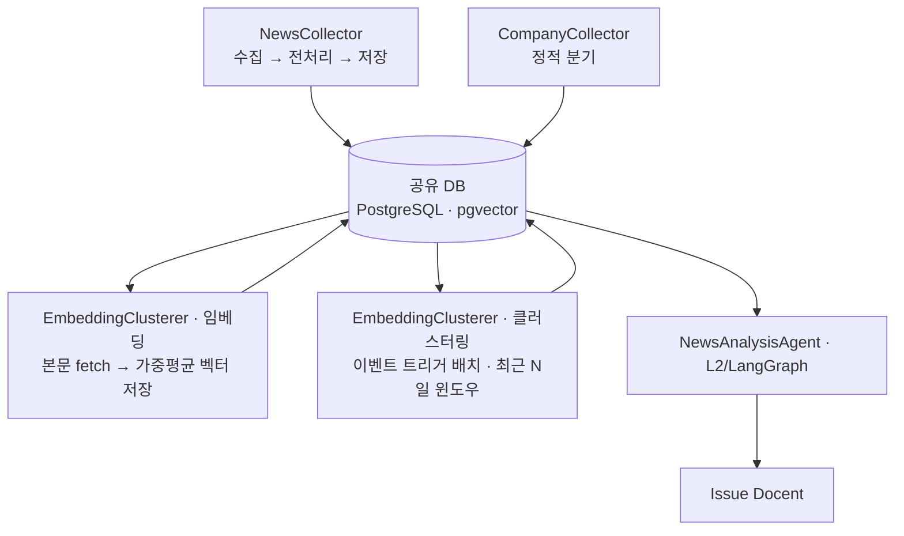
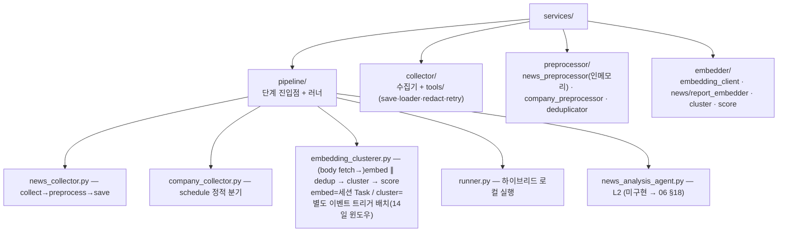

# 파이프라인 오케스트레이션 (L1 정형 단계 — 통합 개요)

> **작성자** Kim minkyoung · **작성일** 2026-05-28 (2026-06-12 핵심 압축 개정 · 2026-06-18 재설계 개정)
>
> **범위** L1 정형 파이프라인의 통합 개요 — 데이터 흐름·단계 인덱스·공유 도구·DB 스키마 맵·에러/보상·빌드 순서
>
> 각 단계의 상세는 02~05가 단일 출처. 실행 골격(스케줄·DAG·러너)은 [00](./00-workflow-airflow.md), 분석(L2)은 [06 §18](./06-news-analysis-design.md#18-newsanalysisagent-설계).

---

## 목차

- [1. 왜 이 구조인가](#1-왜-이-구조인가)
- [2. 전체 구조 & 데이터 핸드오프](#2-전체-구조--데이터-핸드오프)
- [3. 파이프라인 단계 인덱스](#3-파이프라인-단계-인덱스)
- [4. 공유 도구 (Tools)](#4-공유-도구-tools)
- [5. DB 스키마 맵](#5-db-스키마-맵)
- [6. 에러 처리](#6-에러-처리)
- [7. 디렉토리 구조](#7-디렉토리-구조)
- [8. 통합 빌드 순서](#8-통합-빌드-순서)

---

## 1. 왜 이 구조인가

단순 수집은 ① "오늘 중요한 뉴스"를 선정할 주체가 없고 ② 단계들이 서로의 실패를 모른다. 그래서:

- **선정은 EmbeddingClusterer가**: 클러스터를 복합 중요도로 평가해 `news_cluster`에 적재 (→ [05](./05-embedding-clustering-design.md)). 수집 단계는 수집·저장만.
- **오케스트레이션은 Airflow가**: 스케줄·의존성·재시도 전담, 별도 오케스트레이터 객체 없음 (→ [00](./00-workflow-airflow.md)).
- **LangGraph는 추론 단계에만**: 분석→Issue Docent만 LLM 분기가 필요 (→ [06](./06-news-analysis-design.md)). 나머지는 전부 Airflow Task.

> L1/L2 배치 기준과 단계 매핑은 [00 §2·§4](./00-workflow-airflow.md#2-경계-기준--흐름-제어flow-control).

---

## 2. 전체 구조 & 데이터 핸드오프

**핵심 원칙 — 상태 핸드오프**: 단계끼리 직접 호출하지 않고 **공유 DB의 상태 컬럼으로만** 데이터를 전달한다. 각 단계는 "미처리 레코드"만 집어가므로 느슨하게 결합되고, 부분 실패 후 재실행해도 남은 것만 처리된다(멱등). 순수 인메모리인 뉴스 전처리만 예외로 수집 노드 안에 합쳐 1회 저장한다(→ [04 §1.2](./04-preprocessing-design.md#12-전처리의-위치--수집전처리저장을-한-흐름으로)).

| 단계 | 읽는 조건 | 끝나면 |
|------|----------|--------|
| NewsCollector / CompanyCollector | — | INSERT 정제본 (`is_filtered`, `embedding=NULL`, `is_analyzed=false`). 수집 시점에 기사 본문(trafilatura) fetch → 임베딩 입력으로만 사용하고 **DB 미저장(즉시 폐기)** |
| EmbeddingClusterer (임베딩) | `is_filtered=FALSE AND embedding IS NULL` | 본문 청크(overlap)→mean pooling + 제목벡터 가중평균(α=제목0.3/내용0.7)으로 `embedding` 채움 + `is_duplicate` soft 표시 + `reprint_count`(전재 매체 수) 갱신 |
| EmbeddingClusterer (클러스터링) | 저장 벡터 중 최근 N일(14일) 윈도우 + `is_duplicate=FALSE` | **임베딩 완료 트리거(이벤트 기반)**로 윈도우 전체 재클러스터링 → `news_cluster` UPSERT(`importance`), 멤버 겹침으로 cluster id 승계 |
| NewsAnalysisAgent (L2) | `is_analyzed=false` (top_issues 인계) | Issue Docent 생성, `is_analyzed=true` |

> **클러스터링 윈도우**는 최근 N일(기본 14일) 롤링 — 임베딩이 새 벡터를 적재할 때마다 윈도우 전체를 재클러스터링하고, 멤버 겹침을 근거로 기존 cluster id를 승계한다. dedup도 같은 윈도우 기준을 공유해야 한다(창이 어긋나면 dedup 안 된 행이 클러스터에 섞임).
>
> **본문(body)은 transient** — 수집·임베딩 시점에만 fetch해 처리 후 즉시 폐기하며 DB에 영구저장하지 않는다(→ [04](./04-preprocessing-design.md)·[05](./05-embedding-clustering-design.md)).

---

## 3. 파이프라인 단계 인덱스

| # | 단계 (클래스) | 역할 | 배치 | 상세 |
|---|------|------|------|:---:|
| 1 | **NewsCollector** | 수집 → 전처리(인메모리) → 저장 | Airflow Task (정적 순차) | [02](./02-news-collection-design.md#7-뉴스-수집-단계) · [04](./04-preprocessing-design.md) |
| 2 | **CompanyCollector** | 공시·거시·재무 수집 (`schedule` 정적 분기) | Airflow Task | [03](./03-company-data-collection-design.md#7-수집-파이프라인-아키텍처) |
| 3 | **EmbeddingClusterer** | (본문 fetch→)임베딩 → 중복 표시 ‖ 클러스터링 → 이슈 선정 | 임베딩: 시장 세션 Airflow Task / 클러스터링: 별도 이벤트 기반 배치(임베딩 완료 트리거, 14일 윈도우) | [05 §8](./05-embedding-clustering-design.md#8-embeddingclusterer-설계) |
| 4 | **NewsAnalysisAgent** | 분석 → Issue Docent (L2 추론) | LangGraph 슈퍼바이저-워커 | [06 §18](./06-news-analysis-design.md#18-newsanalysisagent-설계) |

> 뉴스 전처리는 별도 Task가 아니라 NewsCollector 안의 인메모리 모듈(`news_preprocessor.run_preprocessing`)이다(→ [04 §1.2](./04-preprocessing-design.md#12-전처리의-위치--수집전처리저장을-한-흐름으로)).

---

## 4. 공유 도구 (Tools)

| 도구 | 경로 | 사용 단계 |
|------|------|-------------|
| `save_tool` | `services/collector/tools/save_tool.py` | **모든 단계 공유** — 테이블별 UPSERT 경계 (기본 DO NOTHING, `update_columns` 지정 시 DO UPDATE) |
| `company_loader` | `services/collector/tools/company_loader.py` | CompanyCollector (is_active 기업 로드) |
| `redact` | `services/collector/tools/redact.py` | 수집기 공통 (로그 API 키 마스킹) |
| `with_retry` | `services/collector/tools/with_retry.py` | 수집기 공통 (지수 백오프 1s→2s→4s) |
| 클러스터링·스코어 | `services/embedder/cluster.py` · `score.py` | EmbeddingClusterer |

> **수집기는 도구가 아니다**: 개별 수집기(`rss_collector` 등)는 `services/collector/*.py` 모듈. `tools/`에는 단계가 공유하는 도구만 둔다.

---

## 5. DB 스키마 맵

### 테이블 소유 맵

| 테이블 | 정의 문서 |
|--------|----------|
| `news` | [02 §8.2](./02-news-collection-design.md#82-db-스키마-sqlalchemy) |
| `news_cluster` | [02 §8.3](./02-news-collection-design.md#83-news_cluster-테이블-클러스터링-산출물) · 스코어 산식 [05 §6](./05-embedding-clustering-design.md#6-주요-이슈-선정--복합-중요도-스코어) |
| `disclosures` · `stock_prices` · `market_indicators` · `financial_statements` · `report_chunks` · `company_entities` | [03 §6](./03-company-data-collection-design.md#6-db-스키마) |
| `news_analysis` · `issue_docent` (L2) | [06 §17](./06-news-analysis-design.md#17-데이터-명세) |

### 파이프라인 공통 상태 컬럼 (단계 간 계약)

이 컬럼들은 **단계 간 핸드오프 게이트**다 — 각 단계가 "읽는 조건"으로 쓰는 값이다. 검토 결과 다음 **4개만** 계약에 해당하며, 각자 서로 다른 단계의 게이트를 담당하므로 **모두 필수**다(하나라도 빠지면 그 핸드오프가 성립하지 않는다).

| 컬럼 | 타입 | 게이트(읽는 단계) | 필수 이유 |
|------|------|------|------|
| `is_filtered` | Boolean | 임베딩이 `FALSE`만 읽음 | 전처리 탈락(24h·제목 중복)을 분석 대상에서 제외. 행을 지우지 않고 표시해 통과율 집계·추적을 남긴다 |
| `embedding` | Vector(N)¹, nullable | 임베딩이 `NULL`만 처리 / 클러스터링이 `NOT NULL` 사용 | 임베딩 핸드오프의 단일 신호. 입력은 제목+본문 가중평균 |
| `is_duplicate` | Boolean | 클러스터링·분석이 `FALSE`만 읽음 | 근접 중복(cosine≥0.95) soft 제외 — 하드 삭제의 FK·재수집 비용을 피한다(→ [05 §4.2](./05-embedding-clustering-design.md#42-중복-제거-cosine--095--하드-삭제가-아니라-soft-flag)) |
| `is_analyzed` | Boolean | L2 분석이 `false`만 처리 | 분석 핸드오프 게이트 |

> **검토 메모**: `is_filtered`만은 "탈락 행을 보존한다"는 선택의 산물이다 — 탈락 행을 아예 INSERT하지 않으면 이 컬럼 없이도 동작하나, 통과율 집계·디버깅 가치를 위해 보존을 택했다. 나머지 셋은 대안이 없다.

### 파생 데이터 컬럼 (계약 아님)

아래는 게이트가 아니라 스코어링이 참고하는 **파생 feature**다 — 어떤 단계의 "읽는 조건"에도 쓰이지 않으므로 단계 간 계약에서 분리한다.

| 컬럼 | 타입 | 의미 |
|------|------|------|
| `reprint_count` | Integer | 같은 기사를 전재한 매체 수 — 화제성 신호. 다층 중복 제거(GUID·URL·제목 Jaccard·cosine)로 묶인 동일 기사군의 매체 수를 카운트, 중요도 스코어가 참고(→ [05 §6](./05-embedding-clustering-design.md#6-주요-이슈-선정--복합-중요도-스코어)) |

- 복합 중요도는 클러스터당 값이라 `news_cluster.importance`로 분리(grain 불일치 방지). `embedding`·`reprint_count`는 기사당이라 `news`에 남는다.
- **기사 본문(body)은 컬럼이 없다** — 수집·임베딩 시점에만 trafilatura로 fetch해 임베딩 입력으로 쓰고 즉시 폐기(transient).
- ¹ **모델 미확정 — bake-off로 결정**(bge-m3 / multilingual-e5-large / gemini-embedding-001 / 베이스라인 ko-sroberta-multitask, 다국어 필수; → [05](./05-embedding-clustering-design.md)). 차원(N)은 선정 모델에 종속이며, 차원이 바뀌면 전 테이블 임베딩을 재계산해야 한다. (이전 접근·검증 이력: `gemini-embedding-001`(768) 3축 평가 1위 확정 → [평가 보고서](../evaluation/00-embedding-model-evaluation.md), 05의 이력 절 참조.)

---

## 6. 에러 처리

### 6.1 재시도와 멱등 재개 (1차 방어)

- **파이프라인 수준**: Airflow가 Task 단위 격리·재시도(`retries=2`). 실패 후 재실행은 상태 컬럼 덕에 "재개"가 된다(멱등) → [00 §7.4](./00-workflow-airflow.md#74-실패-처리재개-멘토-saga-피드백).
- **도구 수준**: 외부 API 일시 실패는 `with_retry` 지수 백오프(1s→2s→4s)로 방어 — Airflow 재시도와 별개의 층.
- **멱등 키**: 모든 적재가 `ON CONFLICT`·unique 제약을 쓰므로, 재시도가 중복 부작용을 만들지 않는다.

### 6.2 실패 보상 설계 (Saga)

**원칙: 전진 복구(forward recovery)를 우선하고, 되돌릴 수 없는 부작용에만 보상(compensation)을 둔다.** 대부분 단계는 멱등이라 "원복"이 아니라 "재개"로 해결된다 — 보상은 *재실행해도 자기치유되지 않는* 지점에만 필요하다.

| 실패 지점 | 부작용 성격 | 복구 전략 |
|----------|------------|----------|
| 수집·임베딩 중단 | 멱등(미처리분만 재처리) | **전진 복구** — 재개(보상 불필요) |
| 클러스터링 중단·부분 | 멱등(트리거 시 윈도우 전체 재계산) | **자기치유** — 다음 트리거가 전체 재클러스터링으로 교정 |
| `news_cluster` UPSERT 부분 실패 | 멱등(재실행 덮어씀) | **전진 복구** |
| 상태 플래그 조기 커밋 후 후속 실패 | lost update 위험 | **예방(커밋 순서)** + 보상으로 플래그 원복 |
| 분석(L2) 중 외부 리소스 생성 후 실패 | 비가역 부작용 | **보상** — 생성 리소스 정리 + `is_analyzed` 원복 |

핵심 규칙:

- **커밋 순서로 보상 창을 최소화**: 비가역 행동(외부 발행·리소스 생성)을 먼저 끝내고, 성공한 뒤에만 게이트 플래그(`is_analyzed=true`)를 세운다. 플래그가 마지막이면 중간 실패 시 다음 run이 자연히 재처리한다.
- **보상은 단계 내부에 국소화**: 진짜 보상이 필요한 곳은 외부 부작용이 있는 L2 분석뿐이다. 보상 핸들러를 해당 Task 안에 두고, 실패 시 ① 생성한 외부 리소스 정리 ② 게이트 플래그 원복(`is_analyzed=false`)으로 다음 run이 재처리하게 한다.
- **이벤트 트리거 재클러스터링은 구조적 자기보상**: 윈도우 전체 재계산이라 어떤 부분 실패도 다음 트리거에 자동 교정된다 — 별도 보상 핸들러가 필요 없다. cluster id가 일시적으로 어긋나도 다음 트리거의 멤버 겹침 매칭이 재정렬한다(수렴).
- **전역 롤백은 두지 않는다**: 단계 간 직접 호출이 없고(공유 DB 핸드오프) 각 단계가 멱등이라, 분산 트랜잭션·전역 롤백 없이 "단계별 재개 + 국소 보상"으로 일관성을 유지한다.

---

## 7. 디렉토리 구조

Airflow DAG(`dags/`)는 [00 §10](./00-workflow-airflow.md#10-디렉토리-구조) 참조.

---

## 8. 통합 빌드 순서

| 순서 | 작업 | 상태 |
|:---:|------|------|
| 0 | 공통 기반: Alembic·AsyncSession·pgvector | 완료 |
| 1 | 수집기 + 전처리 + 도구 | 완료(구 설계) · 본문 fetch(trafilatura)·전재 매체 수 카운트·피드 레지스트리 YAML화 = 재구현 필요 |
| 2 | NewsCollector / CompanyCollector 조립 | 완료(구 설계) · 본문 transient fetch 연동 = 재구현 필요 |
| 3 | EmbeddingClusterer (모델 bake-off 선행 → [05 §11](./05-embedding-clustering-design.md#11-미결-사항)) | 완료(구 설계, 2026-06-11 실완주 검증) · 본문 가중평균 임베딩·모델/클러스터링 bake-off·이벤트 트리거 배치(14일 윈도우·id 승계)·`reprint_count` = 재구현 필요 |
| 4 | 러너 + Airflow DAG | 러너 완료(구 설계) · DAG 예정 · 세션 임베딩 + 이벤트 트리거 클러스터링 분리 = 재구현 필요 |
| 5 | 통합 테스트 (end-to-end) | 1차 실측 완료(구 설계) · 재설계 반영 후 재검증 예정 |

> "완료(구 설계)"는 2026-06-18 재설계 이전 검증분이다 — 재설계 결정에 따라 "재구현 필요"로 표시된 항목은 다시 구현·검증해야 한다.
> L2 분석(NewsAnalysisAgent → Issue Docent)은 [06](./06-news-analysis-design.md)에서 별도 담당.
