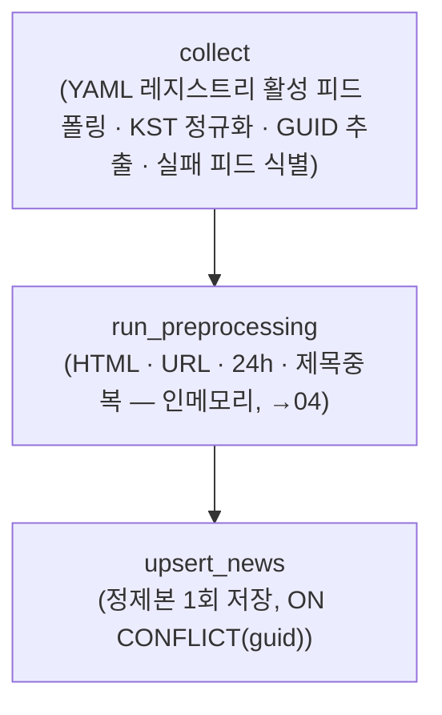
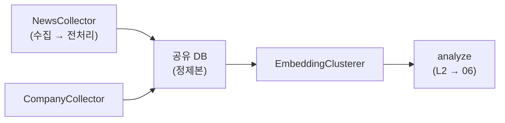

# 뉴스 데이터 수집 기획서

> **작성자** Kim minkyoung · **작성일** 2026-05-28 (2026-06-12 핵심 압축 개정, 2026-06-18 재설계 개정, 2026-06-19 설계 리뷰 보강)
>
> **범위** 뉴스 수집 → 저장 (전처리는 [04](./04-preprocessing-design.md), 임베딩은 [05](./05-embedding-clustering-design.md))
>
> **핵심 결정**: **YAML 피드 레지스트리**로 관리하는 국내외 경제·증권 RSS에서 메타데이터(제목+URL+GUID 등)를 저장하고, **본문은 수집·임베딩 시점에 전체 기사를 trafilatura로 fetch해 처리에 쓰고 즉시 폐기**(DB 영구저장 금지 — 저작권 가드 계승). 키워드 검색 없음. 중복은 **GUID 키 정확 중복 제거 + 다층 유사도 + 전재 매체 수(reprint count) 보존**으로 처리. 종목 식별은 분석 단계(06) NER 담당.

---

## 목차

- [1. 개요](#1-개요)
- [2. 수집 대상 정의](#2-수집-대상-정의)
- [3. 저작권 및 법적 검토](#3-저작권-및-법적-검토)
- [4. 수집 소스 검토](#4-수집-소스-검토)
- [5. 수집 방법](#5-수집-방법)
- [6. 주요 뉴스 선정 — 클러스터링 단계 담당](#6-주요-뉴스-선정--클러스터링-단계-담당)
- [7. 뉴스 수집 단계](#7-뉴스-수집-단계)
- [8. 데이터 명세](#8-데이터-명세)
- [9. 수집 주기](#9-수집-주기)
- [10. 시스템 아키텍처](#10-시스템-아키텍처)
- [11. 구현 로드맵](#11-구현-로드맵)
- [12. 미결 사항](#12-미결-사항)
- [이전 접근 · 검증 이력](#이전-접근--검증-이력)

---

## 1. 개요

뉴스는 장독대의 가장 중요한 원재료다 — 주린이용 풀이 생성·오늘의 주요 이슈·관심 종목 피드·Issue Docent 전부의 입력.

**수집 목표**: 국내 증권 + 해외 글로벌 경제 RSS를 **YAML 레지스트리**로 폭넓게 확보(API 키 불필요). 메타데이터(제목·URL·GUID·발행시각 등)는 저장하고, **본문은 수집·임베딩 시점에 전체 기사를 fetch해 처리 후 즉시 폐기**(DB 미저장).

> 본문을 수집/임베딩 시점에 확보하는 이유: 클러스터링이 대표 기사 선정 **이전** 단계라, 임베딩 입력이 제목+본문(청크 mean pooling) 가중평균 기반이 되면서 당일 전체 기사의 본문이 필요해졌다(상세 [05](./05-embedding-clustering-design.md)). 과거엔 분석 시점에 대표 1건만 fetch했다(→ [이전 접근 · 검증 이력](#이전-접근--검증-이력)).

**일별 수집량**: 피드 수를 YAML로 확장하므로 고정 추정치 대신 운영 모니터링으로 관리. (구 설계 실측 참고 — 2026-06-11 16피드 1회 폴링 552건 → 전처리 통과 391건, [이전 접근 · 검증 이력](#이전-접근--검증-이력))

---

## 2. 수집 대상 정의

**YAML 레지스트리에 등록된 피드**에서 들어오는 **증권·경제 뉴스 전체** — 시장/종목/산업 구분 없이 섞여 들어오고, **수집 시점에 분류하지 않는다**(RSS엔 라벨이 없음). 유형 분류·종목 식별(`company_tags`)은 분석 단계(06) NER 담당.

| 항목 | 내용 |
|------|------|
| 범위 결정 | **YAML 피드 레지스트리 선택**으로 결정 (키워드·종목 쿼리 없음) |
| 국내 / 해외 | 국내외 경제·증권 피드를 최대한 다양하게 확보 (권역 = 한국·미국·글로벌, 선택 메타) |
| 본문 | **수집·임베딩 시점에 전체 기사 fetch → 처리 후 즉시 폐기** (DB 미저장, 저작권 → [3장](#3-저작권-및-법적-검토)) |
| 수집 안 함 (영구저장) | 본문·snippet·이미지 (저작권 → [3장](#3-저작권-및-법적-검토)) |

---

## 3. 저작권 및 법적 검토

**채택 전략: 메타데이터(제목·URL·GUID 등)만 영구 저장, snippet·본문은 DB 저장 금지.** 본문은 처리(임베딩·분석)에 필요한 만큼만 실시간 fetch 후 **즉시 폐기**한다.

> **재설계로 바뀐 점**: 본문 fetch **시점**이 "분석 시점, 대표 1건"에서 "**수집·임베딩 시점, 당일 전체 기사**"로 앞당겨졌다(클러스터링이 대표 선정 이전 단계라 전체 본문 필요 — §8.4). **본문 DB 미저장·처리 후 폐기 원칙과 법적 근거(언론진흥재단 이용규칙·대법원 2021도1533)는 그대로 유효**하다. 다만 fetch 범위가 넓어져 요청량·페이월 부담은 증가하며 이를 감수한다.

근거 — 수집 방법별 리스크:

| 행위 | 리스크 |
|------|--------|
| 공개 RSS에서 제목·URL·GUID 수집·저장 | **낮음** — 언론사가 공개 배포한 메타데이터 |
| 수집·임베딩 시점 본문 fetch 후 즉시 폐기 | **낮음** — 저장 없음, 내부 처리 목적 (fetch 시점만 앞당겨짐) |
| 뉴스 본문 전체 DB 저장 | **높음** — 저작물 무단 복제 |
| robots.txt 위반 직접 크롤링 | **높음** — 업무방해 소지 (대법원 2021도1533 기준) |

장독대는 투자 추천이 아닌 **학습 서비스**라 약관 해석에 유리하나, 유료화·광고 수익화 시 재검토가 필요하다.

---

## 4. 수집 소스 검토

**채택**: 국내외 경제·증권 RSS를 폭넓게 (모두 API 키 불필요).
**제외**: Finnhub·Naver API(키 의존성), BigKinds(유료 전환).

피드 목록의 **정본은 YAML 설정 파일(피드 레지스트리)** — 행마다 **언론사 / 피드 URL / 권역(한국·미국·글로벌, 선택) / 갱신주기 / 활성화 여부**를 둔다. 피드 추가·비활성화는 YAML 편집만으로 처리하며, 코드 배포 없이 운영 중 조정할 수 있다(역사: 과거엔 16개 고정 RSS를 코드 상수로 관리 → [이전 접근 · 검증 이력](#이전-접근--검증-이력)).

| 컬럼 | 설명 |
| ------ | ------ |
| 언론사 | 소스 식별용 표시명 |
| 피드 URL | RSS 엔드포인트 |
| 권역 (선택) | 한국 · 미국 · 글로벌 |
| 갱신주기 | 폴링 주기 힌트 (시장 세션 기반 — §9) |
| 활성화 여부 | false면 폴링 제외 (비활성화도 YAML 편집) |

---

## 5. 수집 방법

모든 소스가 RSS이므로 `feedparser` + `httpx.AsyncClient`로 통일 — `Semaphore`로 동시 요청 제한, User-Agent 지정, YAML 레지스트리의 활성 피드를 병렬 폴링 후 평탄화. 구현: [`services/collector/rss_collector.py`](../../services/collector/rss_collector.py).

수집 단계:

1. **메타 폴링** — `title` · `url` · `source` · `guid`(피드 제공, 없으면 정규화 URL) · `published`(KST naive 정규화 — 국내 피드는 KST, 해외 피드는 UTC, 오프셋 없으면 UTC로 가정해 9시간 어긋남 방지).
2. **중복키 적용** — `guid`(없으면 정규화 URL) 키로 수집 시점 정확 중복 제거(§7).
3. **본문 추출** — 살아남은 **전체 기사** URL을 **trafilatura**로 fetch(`follow_redirects` 필수 — 국내 다수 매체 http→https 301). 임베딩/분석 처리 후 즉시 폐기, DB 영구저장 안 함(§8.4). 요청 속도·동시성은 위 `Semaphore`로 제한.

---

## 6. 주요 뉴스 선정 — 클러스터링 단계 담당

"오늘 주목할 뉴스" 선정은 **클러스터(기사 그룹) 단위 평가**라 임베딩·클러스터링 후에야 가능하다 → 수집 단계는 수집·저장만 하고, 클러스터링·복합 중요도·상위 이슈 선정은 EmbeddingClusterer가 담당한다. 벤치마크·신호·가중치의 단일 출처는 [05 §6](./05-embedding-clustering-design.md#6-주요-이슈-선정--복합-중요도-스코어).

---

## 7. 뉴스 수집 단계

`NewsCollector`는 메인 DAG가 시장 세션 기반 주기로 실행하는 **수집 전용** 컴포넌트다. `collect → preprocess(인메모리) → save`의 정적 순차이며 분기·반복·LLM 추론이 없어 Airflow Task로 매핑된다(→ [00 §5.2](./00-workflow-airflow.md#52-뉴스-수집-정적-순차--airflow-task로-교정)). 구현은 [`services/pipeline/news_collector.py`](../../services/pipeline/news_collector.py).

**본문 fetch는 수집 단계가 아니다.** 본문은 DB에 저장하지 않고(저작권 §8.4), 임베딩은 별도 staged 단계(EmbeddingClusterer가 공유 DB에서 미임베딩분을 읽음)라, 전체 기사 본문은 **임베딩 직전(§5)에 `trafilatura`로 fetch 후 폐기**한다. `reprint_count` 집계도 중복 병합이 일어나는 §5 dedup 단계에 속한다. 따라서 `NewsCollector`는 `collect → preprocess → upsert`만 수행한다.

> **State는 데이터가 아니라 보고다.** 반환값(XCom)엔 카운트와 실패 신호(`collected`/`kept`/`saved`/`failed_feeds`)만 담는다 — 실제 데이터 핸드오프는 공유 DB 상태 컬럼으로(→ [01 §2](./01-pipeline-orchestration-design.md#2-전체-구조--데이터-핸드오프)). `failed_feeds`는 일부 피드의 조용한 실패를 구조적 신호로 끌어올려 수집량 급감을 인지하게 한다.

---

## 8. 데이터 명세

### 8.1 수집·저장 필드 정의

`news` 필드를 **채워지는 시점**으로 구분한다. 전체 스키마 정본은 ORM [`app/db/orm_models/news.py`](../../app/db/orm_models/news.py).

| 필드 | 채우는 시점 | 설명 |
|------|------------|------|
| `title` / `url` | 수집→전처리 | HTML 정제·트래킹 파라미터 제거 후 저장 (url unique 아님 — 멱등키는 `guid`, §8.2) |
| `guid` | 수집 | 수집-시점 정확 중복키 — 피드 제공 GUID, 없으면 정규화 URL (§7) |
| `rss_source` / `news_source` | 수집 | 피드 식별자 / 언론사 |
| `published_at` (nullable) | 수집 | 발행 시각 KST naive (피드에 없으면 NULL) |
| `reprint_count` | 전처리(중복 병합) | 거의 동일 전재 기사를 받아쓴 매체 수 — 화제성 신호 (§7) |
| `created_at` | 저장 | DB 적재 시각 (server_default, KST naive) |
| `is_filtered` | 전처리 | true = 24h 초과·제목 중복 → 분석 제외 |
| `is_duplicate` | 임베딩(중복) | true = cosine ≥ 0.95 근접 중복 soft flag (→ [05 §4.2](./05-embedding-clustering-design.md#42-중복-제거-cosine--095--하드-삭제가-아니라-soft-flag)) |
| `embedding` Vector(768) | 임베딩 | title + content(본문) 가중평균 기반 임베딩 (상세 → [05](./05-embedding-clustering-design.md)) |
| `is_analyzed` | 분석 | 분석 처리 여부 |
| _(content / 본문)_ | _수집·임베딩 시점_ | **일시(transient)** — 처리 후 폐기, **DB 영구저장 안 함** (§8.4, 저작권) |

**별도 테이블로 분리**: 클러스터·스코어는 기사 그룹당 값이라 `news_cluster`로(grain 불일치 방지), 유형·종목은 분석 산출물이라 `news_analysis`(06)로.
**저장하지 않는 것**: 본문·snippet·이미지·기자명 (저작권). 본문은 처리에만 쓰고 폐기한다.

### 8.2 DB 스키마 (SQLAlchemy)

정본은 ORM [`app/db/orm_models/news.py`](../../app/db/orm_models/news.py). 필수 인덱스:

| 인덱스 | 용도 |
|------|------|
| `guid` unique | **수집-시점 정확 중복키 = 멱등 저장 충돌키** (피드 GUID/정규화 URL, §7) |
| `ix_news_url` (일반) | URL 조회·중복 진단 — **unique 아님**(아래 주석) |
| `ix_news_unanalyzed` (partial) | 미분석분 최신순 조회 |
| `ix_news_embedding` (HNSW, cosine) | 클러스터링·유사도 검색 — **벡터 쌓이기 전 미리 생성** |
| `ix_news_created_at` | "당일 수집분" 창 조회 (dedup·클러스터링) |

> **url unique 강등(결정 2026-06-19)**: 멱등 충돌키는 `guid` 하나다. `url`도 unique로 두면 `ON CONFLICT`이 한 제약만 타겟할 수 있어, 같은 url·다른 guid인 전재(신디케이션) 기사에서 `IntegrityError`로 배치 저장이 깨진다. `guid` 폴백이 정규화 URL이라 GUID 없는 피드는 사실상 url 멱등도 보장되므로 url은 일반 인덱스로 강등한다(마이그레이션 `307cade08bba`).

### 8.3 `news_cluster` 테이블 (클러스터링 산출물)

**클러스터당 1행** — `news`(기사당)와 grain이 다르다. `run_date` · `representative_news_id`(= member[0]) · `member_news_ids`(중심 근접순 정렬) · `size` · `importance`. `(run_date, representative_news_id)` 유니크로 재실행 멱등. 정본: ORM [`news_cluster.py`](../../app/db/orm_models/news_cluster.py), 스코어 산식: [05 §6](./05-embedding-clustering-design.md#6-주요-이슈-선정--복합-중요도-스코어).

### 8.4 본문 fetch 전략

**수집·임베딩 시점에 당일 전체 기사 URL을 trafilatura로 실시간 fetch 후 폐기**(`follow_redirects` 필수 — 국내 다수 매체 http→https 301). 대표 1건이 아니라 전체를 fetch하는 이유: 클러스터링이 대표 선정 이전 단계이고 임베딩 입력이 제목+본문 가중평균이라(→ [05](./05-embedding-clustering-design.md)) 당일 전체 본문이 필요하기 때문. 본문은 **DB에 저장하지 않고 처리 직후 폐기**(저작권 — §3).

| 상황 | 대응 |
|------|------|
| 정상 fetch | 본문을 임베딩·분석 입력으로 사용 후 폐기 |
| 페이월·실패 | 해당 기사는 title만으로 처리 (본문 없이 fallback) |
| 전부 실패 | title만으로 분석 (품질 저하 허용) |

> 과거 설계는 분석 시점에 **대표 1건만** fetch했다(실측 성공률 92%, → [이전 접근 · 검증 이력](#이전-접근--검증-이력)). 전체 fetch로 바뀌며 요청량·페이월 부담이 늘었고 이를 감수한다.

#### 8.4.1 요청 폭주·차단 방어 (전체 fetch 전환의 운영 가드)

전체 기사 fetch는 피드가 늘수록 **특정 매체 IP 차단(429/403)·페이월·요청 폭주**에 노출된다. 우회(프록시 로테이션)는 약관·robots 위반 소지가 있어 **지양**하고, **절제·격리·fallback**으로 막는다.

| 가드 | 정책 |
|------|------|
| **도메인별 rate limit** | 호스트(도메인)별 동시성·초당 요청 상한을 두어 한 매체에 폭주하지 않게 한다(피드 단위 `Semaphore`만으로는 같은 매체 다피드 폭주를 못 막음). |
| **429/403 백오프** | `Retry-After` 존중 + 지수 백오프, 한도 초과 시 해당 도메인 **이번 run 스킵**(title-only fallback). 4xx·5xx는 재시도하지 않고 격리. |
| **fetch 전체 예산 타임아웃** | 임베딩 단계 fetch에 총 시간 예산을 두고 초과분은 **title-only로 강제 전환** — 세션 배치 SLA가 fetch latency에 끌려가지 않게 한다. |
| **robots/약관** | 공개 RSS가 가리키는 본문 페이지만 fetch, `User-Agent` 명시, robots 차단 경로는 제외. |

> 우회가 아니라 **차단당하면 우아하게 포기(title-only)** 가 원칙 — 본문은 어디까지나 임베딩 신호 보강용이고, 없으면 제목 중심으로 진행하도록 이미 설계돼 있다(§8.4 표·[04 §6](./04-preprocessing-design.md#6-에러-처리)).

### 8.5 중복 제거 · 전재 카운트

다층 중복 제거를 **모두 유지**하되, 수집-시점 정확 중복 제거와 화제성 신호를 추가했다(병합 설계).

| 계층 | 키/기준 | 동작 |
|------|------|------|
| 수집(정확) | `guid`(피드 제공, 없으면 정규화 URL) | 동일 GUID는 ON CONFLICT로 1건만 — 수집 시점 정확 중복 제거 강화 (신규) |
| 전처리(제목) | 제목 Jaccard ≥ 0.8 | 근접 제목 중복 필터 (계승) |
| 임베딩(의미) | cosine ≥ 0.95 | 근접 중복 soft flag `is_duplicate` (계승, → [05 §4.2](./05-embedding-clustering-design.md#42-중복-제거-cosine--095--하드-삭제가-아니라-soft-flag)) |

**전재 카운트(reprint_count)**: 거의 동일한 전재 기사는 대표 1건만 남기되, **몇 개 매체가 받아썼는지 카운트**해 화제성 신호로 보존한다(신규). 같은 사안을 여러 매체가 전재할수록 주목도가 높다는 가정 — 클러스터 중요도(→ [05 §6](./05-embedding-clustering-design.md#6-주요-이슈-선정--복합-중요도-스코어))의 입력 신호로 쓰일 수 있다.

---

## 9. 수집 주기

**수집·임베딩**은 시장 세션 기반의 합리적 주기로 폴링한다(프리마켓·장중·마감 등 — 1분마다 수집하지는 않음).

**클러스터링**은 수집과 분리된 **별도 이벤트 기반 배치**로 돈다(임베딩 완료 시 트리거 — 대표 선정·중요도 갱신). 수집·임베딩이 하루 4회(시장 세션 기반)이라 세션 사이엔 클러스터링 입력이 바뀌지 않는다. 따라서 고정 주기 재계산은 낭비이고, 데이터 도착(임베딩 완료) 이벤트로 트리거한다.

구체 스케줄·세션 구분의 단일 출처는 Airflow DAG(→ [00 §7](./00-workflow-airflow.md#7-dag-구성)), 클러스터링 주기 설계는 [05](./05-embedding-clustering-design.md)다.

---

## 10. 시스템 아키텍처

수집·임베딩·분석을 독립 단계로 분리하고 Airflow DAG가 조율한다. 전체 흐름·디렉토리는 [01](./01-pipeline-orchestration-design.md), DAG·스케줄은 [00](./00-workflow-airflow.md)이 단일 출처.

---

## 11. 구현 로드맵

| Phase | 내용 | 상태 |
|:---:|------|:---:|
| 1 | RSSCollector + 도구(save_tool 등) + News 스키마 | 완료 (구 설계) |
| 2 | NewsCollector 조립 (collect→preprocess→save) + pgvector | 완료 (구 설계) |
| 3 | 전처리 모듈 (인메모리, →04) | 완료 (구 설계) |
| 4 | 러너 완료 + Airflow DAG (시장 세션 4분할) | 진행 중 |
| 5 | 본문 fetch 품질 검증 | 1차 실측 완료 (대표 1건 92%, 구 설계) — 전체 fetch 재검증 필요 |
| R1 | **YAML 피드 레지스트리** (소스 정본 코드→YAML 이관) | 완료 (2026-06-19, `config/news_feeds.yaml`) |
| R2 | **본문 전체 fetch**(수집·임베딩 시점, 처리 후 폐기) + 임베딩 입력 연동(05) | 재구현 필요 |
| R3 | **GUID 중복키** + `guid` unique 인덱스 (스키마 변경·마이그레이션) | 완료 (2026-06-19, url unique→일반 인덱스 강등) |
| R4 | **reprint_count** 전재 카운트 집계·보존 | 재구현 필요 |
| R5 | 수집·임베딩 시장 세션 주기 + 클러스터링 이벤트 기반 배치(임베딩 완료 트리거) 분리 (00·05) | 재구현 필요 |
| R6 | **본문 fetch 운영 가드**(도메인별 rate limit + 429/403 백오프 + fetch 전체 예산 타임아웃 → title-only fallback, §8.4.1) | 재구현 필요 |

---

## 12. 미결 사항

| 항목 | 내용 | 상태 |
|------|------|------|
| 임베딩 모델 | `gemini-embedding-001`(768) — 3축 평가 전 축 1위 | 확정 (2026-06-09) |
| 본문 fetch 품질(전체) | 대표 1건 92% 성공은 구 설계 실측 — **전체 기사 fetch 성공률·페이월 비율·요청량 재검증 필요** | 재설계로 재측정 |
| YAML 피드 레지스트리 스키마 | 컬럼 확정(언론사/URL/권역/갱신주기/활성) + 초기 피드 목록 큐레이션 | 재구현 시 |
| reprint_count 활용 | 화제성 신호로 클러스터 중요도(05 §6)에 어떻게 반영할지 | 05와 연동 |
| 클러스터링 임계값 | 실뉴스 교정 테스트 | 데이터 누적 후 |
| 관심 종목 없는 초기 사용자 | 기본 피드만 제공할지 | 기획 논의 |

---

## 이전 접근 · 검증 이력

2026-06-18 재설계 이전의 검증된 설계를 보존한다(왜 바꿨는지 + 실측 수치).

| 항목 | 구 설계 (검증됨) | 왜 바뀌었나 |
|------|------------------|-------------|
| 피드 레지스트리 | 16개 고정 RSS(국내 13 + investing.com 3)를 **코드 상수**(`services/collector/rss_feeds.py`)로 관리 | 운영 중 코드 배포 없이 피드를 다양하게 확장·비활성화하려고 **YAML 레지스트리**로 이관 |
| 본문 fetch | **분석 시점**에 **대표 기사 1건만** trafilatura fetch 후 폐기 | 임베딩 입력이 제목+본문 가중평균이 되고 클러스터링이 대표 선정 이전 단계라, **수집·임베딩 시점에 당일 전체 기사** fetch로 앞당김 |
| 본문 저장 | 제목+URL만 저장, 본문 DB 영구저장 금지 | **유지** — 본문 미저장·처리 후 폐기 원칙과 법적 근거(언론진흥재단 규칙·대법원 2021도1533)는 그대로 계승 |
| 중복 제거 | URL unique(ON CONFLICT) + 제목 Jaccard ≥ 0.8 + cosine ≥ 0.95 soft flag | 다층 모두 유지하되 **GUID 정확 중복키**와 **reprint_count 전재 카운트**를 병합 추가 |
| 수집 주기 | 하루 2회 09:00 / 15:30 | **시장 세션 기반 수집 + 이벤트 기반 클러스터링(임베딩 완료 트리거) 분리**로 전환 |

**실측 수치(보존)**:

- 본문 fetch 성공률 **92%**(실험2, 리다이렉트 추적 시, 2026-06-11) — 단, 이는 **대표 1건** fetch 기준. 전체 기사 fetch에서는 재측정 필요.
- 수집량 실측(2026-06-11): 16피드 1회 폴링 **552건** → 전처리 통과 **391건**.
- 일별 추정(구 설계): 국내 13피드 ~650 + investing.com 3피드 ~30 = ~680건/일, 중복 제거 후 ~310건.

---

## 참고 자료

- [Neon pgvector 공식 문서](https://neon.com/docs/extensions/pgvector)
- [디지털 뉴스콘텐츠 이용규칙 (한국언론진흥재단)](https://www.kpf.or.kr/front/board/boardContentsView.do?board_id=291&contents_id=855b0c963b5c4a42ba6b26d06c7186d4)
- [웹크롤링 법적 판단 기준 — 대법원 2021도1533](https://atlaw.kr/kr-blog/%EC%9B%B9%ED%81%AC%EB%A1%A4%EB%A7%81%EC%9D%98-%ED%98%95%EC%82%AC%EC%B2%98%EB%B2%8C-%EA%B0%80%EB%8A%A5%EC%84%B1-%EB%8C%80%EB%B2%95%EC%9B%90-2021%EB%8F%841533-%ED%8C%90%EA%B2%B0-%EC%99%84%EC%A0%84/)
