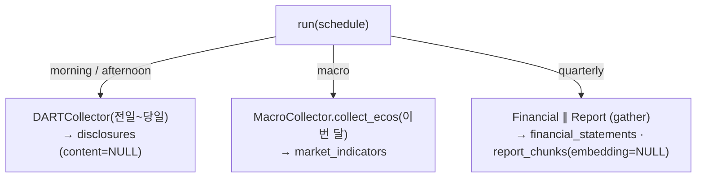

# 기업 데이터 수집 기획서

> **작성자** Kim minkyoung · **작성일** 2026-05-28 · **개정** 2026-06-08 구현 반영 / 2026-06-12 핵심 압축 / 2026-06-18 뉴스 재설계 반영 — 기업 수집 영향 없음
>
> **범위** 기업 데이터 수집 → DB 적재 / on-demand 조회 → RAG 소스 준비
>
> **핵심 결정**: 재무는 dart-fss 대신 **DART 구조화 API 직접 호출** · **주가·환율은 적재하지 않고 on-demand 조회** · 거시지표·공시·재무·사업보고서 청크는 적재(RAG·추세 대상) · 청크 타입 3종(`business_summary`/`director_analysis`/`audit_opinion`)

---

## 목차

- [1. 목적](#1-목적)
- [2. RAG · pgvector 필요성](#2-rag--pgvector-필요성)
- [3. 수집 대상 분류](#3-수집-대상-분류)
- [4. API별 상세](#4-api별-상세)
- [5. DB 적재 방법론](#5-db-적재-방법론)
- [6. DB 스키마](#6-db-스키마)
- [7. 수집 파이프라인 아키텍처](#7-수집-파이프라인-아키텍처)
- [8. 에러 처리 전략](#8-에러-처리-전략)
- [9. API 키 목록](#9-api-키-목록)
- [10. 구현 로드맵](#10-구현-로드맵)

---

## 1. 목적

기업 데이터의 핵심 목적은 분석 파이프라인 `ImpactAnalysisChain`에 **기업 컨텍스트(`related_companies`)를 주입**하는 것이다. EntityExtractionChain이 뉴스에서 기업명을 추출하면, 해당 기업의 사업보고서·재무를 pgvector로 검색해 문자열로 구성한다.

| 데이터 | 출처 | 적재/조회 | 용도 |
|--------|------|----------|----------|
| 기업 마스터(유니버스) | DART corpCode.xml + PyKRX | 적재 (`company_entities`) | 수집 대상 + Entity Linking 기준 |
| 공시 | DART `list.json` | 적재 (메타만, 본문은 분석 시 fetch) | 분석 input + RAG |
| 재무제표 | DART `fnlttSinglAcntAll.json` | 적재 (`financial_statements`) | RAG 핵심 (구조화 수치) |
| 사업보고서 텍스트 | DART `document.xml` + 청킹 | 적재 (`report_chunks`) | RAG 핵심 (pgvector 검색) |
| 주가 (국내) | FinanceDataReader | **on-demand 조회** | 분석 보조 컨텍스트 |
| 환율 | FinanceDataReader | **on-demand 조회** | 거시 이슈 컨텍스트 |
| 거시지표 (금리·CPI·M2) | 한국은행 ECOS | 적재 (`market_indicators`) | 거시 이슈 컨텍스트 |
| 해외 주가·시총·외국인 | yfinance·pykrx | 미구현 (Phase 4 확장) | 보조 컨텍스트 |

> **on-demand의 논리**: 주가·환율은 임베딩 대상이 아니라 프롬프트 주입용 보조 컨텍스트다. 분석 대상도 소수 related company뿐이고, API가 기간 파라미터로 과거를 언제든 재조회할 수 있다. 따라서 상시 적재의 실익이 없다. 다만 분석에 사용한 값은 재현성을 위해 산출물에 스냅샷으로 보존한다.

---

## 2. RAG · pgvector 필요성

- **pgvector**: Neon이 기본 지원 — 별도 벡터 DB(Pinecone 등) 없이 관계형+벡터를 한 DB로. 용도: 유사 중복 제거·클러스터링·RAG 검색·과거 이슈 검색.
  - 단, 뉴스 임베딩·클러스터링(유사 중복 제거·클러스터링)은 재설계 중 — 임베딩 모델·클러스터링 방식 모두 미확정([05](./05-embedding-clustering-design.md) 참조). 기업 데이터 RAG·`ReportChunk` 임베딩은 이 변경과 무관하게 유지(→ [05 §7](./05-embedding-clustering-design.md#7-rag-소스-준비--reportchunk-임베딩)).
- **RAG**: 뉴스만으로는 영향도 판단 근거가 빈약하다. 예: "삼성전자 감산 발표" + RAG(반도체 매출 비중 60%, 최근 영업이익 -4조) → 구체적이고 주린이가 이해할 수 있는 분석.
- **흐름**: 기업명 추출(NER) → 사업보고서 청크 pgvector 검색 → `related_companies`로 ImpactAnalysisChain 주입.
- **구현**: langchain PGVector 대신 **raw pgvector + ORM**(`app/llm/rag.py`의 `get_company_context`) — 의존성 추가 없이 EmbeddingClient(비대칭 task_type)와 일관 (→ [05 §7](./05-embedding-clustering-design.md#7-rag-소스-준비--reportchunk-임베딩)).

---

## 3. 수집 대상 분류

§1.2 표가 정본 — 분류 기준은 ① 적재 vs on-demand(시계열 추세를 로컬에서 반복 분석하는가) ② 주기(이벤트/일/월/분기).

---

## 4. API별 상세

### 4.1 DART REST API — 공시 수집

`list.json`으로 (기업 × 공시유형 A/B)를 병렬 수집한다. `total_page` 기준으로 페이지네이션하고, `status=013`(없음)은 정상 종료로 처리한다. **메타데이터만 저장하고 `content=NULL`로 둔다** — 본문은 분석 대상으로 선정된 공시만 `document.xml`로 fetch한다(전량 선저장은 낭비). DART는 공공 데이터라 본문 저장에 저작권 리스크가 없다(뉴스와 다른 점). 공시 유형은 `A`(정기보고서 → RAG)와 `B`(주요사항 → 분석 직접 input)로 나뉜다. 구현: [`dart_collector.py`](../../services/collector/dart_collector.py).

### 4.2 DART 구조화 재무 API — 재무제표

**dart-fss 라이브러리 대신 `fnlttSinglAcntAll.json` 직접 호출** — DART가 이미 구조화 JSON을 제공하므로 파싱 라이브러리 의존이 불필요하고, httpx 비동기로 다른 수집기와 패턴 통일. 핵심 4계정(매출·영업이익·순이익·자산총계)만 수집.

- **연결(CFS) 우선, 개별(OFS) 폴백** — 종속회사 없는 기업은 CFS가 013이므로.
- **손익은 `IS`/`CIS` 둘 다 허용** — 회사별 보고 위치가 다름.
- 구현: [`financial_collector.py`](../../services/collector/financial_collector.py).

#### 4.2.1 사업보고서 텍스트 청킹 — document.xml

`list.json`으로 최신 사업보고서 rcept_no 조회(정정 공시 대비 `rcept_dt` 최신본) → `document.xml`(ZIP) 다운로드 → XML 텍스트 추출 → `parse_report_sections()`로 3개 대섹션을 소제목 단위 분할:

| 보고서 대섹션 | chunk_type |
|------|------------|
| II. 사업의 내용 | `business_summary` |
| IV. 이사의 경영진단 및 분석의견 | `director_analysis` |
| V. 회계감사인의 감사의견 등 | `audit_opinion` |

구현: [`report_collector.py`](../../services/collector/report_collector.py) + [`company_preprocessor.py`](../../services/preprocessor/company_preprocessor.py).

### 4.3 주가 — FinanceDataReader (on-demand)

적재하지 않고 분석 시점에 related company의 최근 N일 일봉(OHLCV)만 조회. 반복 호출엔 단기 캐시 권장, 재현성 필요 값은 분석 산출물에 스냅샷. 구현: [`stock_collector.py`](../../services/collector/stock_collector.py). pykrx 시총·외국인, yfinance 해외 주가는 Phase 4(yfinance는 비공식 API — rate limit·캐시 필수).

### 4.4 환율 — FinanceDataReader (on-demand)

USD/JPY/EUR/CNY ÷ KRW, 통화 4종이라 호출 비용 무시 수준 — 별도 환율 API를 추가하지 않고 주가와 같은 라이브러리로 통일. 구현: [`macro_collector.py`](../../services/collector/macro_collector.py)의 `collect()`.

### 4.5 거시지표 — 한국은행 ECOS API (적재)

월별 3종만 적재 — FinanceDataReader가 못 주는 지표.

| 지표 | 통계표 | 항목 | 주기 |
|------|------|------|------|
| 기준금리 | `722Y001` | `0101000` | `M` |
| CPI | `901Y009` | `0` | `M` |
| M2(평잔, 원계열) | `161Y006` | `BBHA00` | `M` |

> 정정 기록: M2 구표 `101Y004` 폐지 → `161Y006`. 주기 코드는 `M`(구 표기 `MM`은 오기). 환율·코스피는 ECOS 적재 대상 아님.

구현: `macro_collector.collect_ecos()`.

---

## 5. DB 적재 방법론

### 5.1 데이터 유형별 전략

**판단 기준: "시계열 추세 분석을 로컬에서 반복하는가"** — 그렇다면 적재, 아니면 on-demand.

| 유형 | 전략 | 멱등 키 |
|------|------|----------|
| 주가·환율 | **on-demand** (적재 안 함) | — |
| 거시지표 (월별) | 적재 | `(indicator_type, currency, date)` + **NULLS NOT DISTINCT**(PG15+, currency NULL 멱등) |
| 공시 (이벤트) | 적재 (메타만) | `rcept_no` unique |
| 재무제표 (분기) | 적재 | `(corp_code, year, quarter)` |
| 사업보고서 청크 (분기) | 적재 + 임베딩 | `(corp_code, report_year, chunk_type, subsection)` |

모든 적재는 `ON CONFLICT DO NOTHING`(save_tool) — 재실행 안전(멱등).

### 5.2 전체 종목 vs 관심 종목

MVP는 관심 종목 + 코스피200 대형주, Phase 4에서 전 종목(~2,500개; 5년 ~315만 행 — PostgreSQL 감당 가능) 확장.

### 5.3 Backfill vs Incremental — 적재 대상에만

`scripts/`(최초 1회 수동: 거시 5년 ~5분, 공시·재무·보고서 N년 ~30분)와 DAG(주기 실행)를 분리한다. 일회성 코드와 주기 코드가 섞이면 재실행 사고 위험이 있기 때문이다. **뉴스에는 이 분리가 없다.** RSS는 최근 N건만 노출해 과거 일괄 수집 소스 자체가 없으므로 incremental만 존재한다.

### 5.4 사업보고서 청킹 전략

- **텍스트**: 섹션 청킹(§4.2.1) 후 `ReportChunk` 임베딩 — 원문 수십~수백 페이지는 LLM 컨텍스트 초과.
- **재무 수치**: 텍스트 청킹 대신 `FinancialStatement` 구조화 컬럼 → RAG 시점에 포맷된 문자열로 변환(LLM이 포맷 문자열을 더 정확히 읽음). 두 방법 병행.

---

## 6. DB 스키마

정본은 ORM([`app/db/orm_models/`](../../app/db/orm_models/)) — 여기는 키·역할 요약만.

| 테이블 | 핵심 컬럼 | 비고 |
|--------|----------|------|
| `disclosures` | `rcept_no`(unique) · `content`(NULL, 분석 시 fetch) · `disclosure_type` A/B · `is_analyzed` · `embedding` | 공공 데이터라 본문 저장 가능 |
| `stock_prices` | `(stock_code, date)` unique · OHLCV · `market_cap` | **정의만 유지** — on-demand 전환, backfill·Phase 4 대비 |
| `market_indicators` | `(indicator_type, currency, date)` unique NULLS NOT DISTINCT | ECOS 월별 3종 적재 |
| `financial_statements` | `(corp_code, year, quarter)` unique · 핵심 4계정 · `rcept_no`(원천 추적) | |
| `report_chunks` | `(corp_code, report_year, chunk_type, subsection)` unique · `content` · `embedding` HNSW | RAG 검색 대상 |
| `company_entities` | `stock_code` unique · `name_ko/en` · `aliases[]` · `corp_code` · `market` · `sector_id` · `is_active` | 아래 참조 |

**CompanyEntity — 수집 유니버스 겸 Entity 사전.** "삼성전자/Samsung/삼전/SSNLF"가 같은 기업임을 LLM에 맡기면 오매핑하므로 서비스 차원 사전으로 관리(06 `company_tags` 추출이 조회). 수집기들은 `company_loader.load_active_companies()`로 `is_active=True`만 로드. 유니버스는 `company_master_collector`가 동기화하되 **신규는 `is_active=False`로 삽입**(추적 종목 보존), 운영자가 승격. aliases는 실제 언론 사용 축약어·영문 ticker·과거 사명·우선주만 포함(seed/수동 관리).

---

## 7. 수집 파이프라인 아키텍처

### 7.1~7.2 구조와 실행 타이밍

CompanyCollector는 Airflow가 실행하는 단계 컴포넌트 — 단계 간 직접 통신 없이 공유 DB로 전달(→ [01 §2](./01-pipeline-orchestration-design.md#2-전체-구조--데이터-핸드오프)).

| 시점 | 내용 |
|------|------|
| 09:00 / 15:30 (메인 DAG, 뉴스와 병렬) | 전일~당일 공시 메타데이터 |
| 월별 (macro DAG) | ECOS 거시지표 |
| 분기 (quarterly DAG) | 재무제표 + 사업보고서 청킹 |
| 주기 동기화 | 종목 유니버스 (corpCode + PyKRX) |

> 구 16:30 "주가·환율 장 마감 수집" 슬롯은 on-demand 전환으로 제거됨.

### 7.3~7.4 CompanyCollector 구조와 흐름

`schedule` 값에 따라 정적으로 분기한다. 구현은 [`services/pipeline/company_collector.py`](../../services/pipeline/company_collector.py)(완료).

수집기 모듈(`services/collector/*`)은 전부 구현 완료이고, backfill 스크립트(`scripts/backfill_*.py`)도 실행 완료다. 주가는 어느 schedule에도 적재 노드가 없다.

### 7.5 각 모듈 책임

| 모듈 | 책임 |
|------|------|
| `DARTCollector` | 공시 메타 (기업×유형 병렬, 에러 격리, 페이지네이션) |
| `FinancialCollector` | 재무 4계정 (CFS→OFS 폴백, IS/CIS 허용) |
| `ReportCollector` | 사업보고서 ZIP→XML→섹션 청킹 (`rcept_dt` 최신본) |
| `StockCollector` | 국내 일봉 on-demand (결측 행 스킵) |
| `MacroCollector` | 환율 on-demand + ECOS 적재 |
| `company_master_collector` | 유니버스 동기화 (기존 행은 market·corp_code만 갱신, is_active·name_ko 보존) |

### 7.6 Backfill

§5.3 참조 — 적재 대상만, 최초 1회 수동, `ON CONFLICT`로 중단 후 재실행 안전.

---

## 8. 에러 처리 전략

파이프라인 수준은 [01 §6](./01-pipeline-orchestration-design.md#6-에러-처리). 기업 수집 추가 항목:

| 시나리오 | 처리 |
|---------|------|
| DART 응답 없음 | 지수 백오프 3회(1s→2s→4s) 후 ERROR |
| 공시 본문 파싱 실패 | 메타만 저장(content=NULL) — 본문은 분석 시 fetch라 수집 무영향 |
| FDR 조회 실패 (on-demand) | 종목 단위 격리·스킵 → 주가 컨텍스트 없이 분석 진행 |
| CFS 데이터 없음 | OFS 폴백, 둘 다 없으면 해당 기업·분기 스킵 |
| 보고서 ZIP/XML 파싱 실패 | 해당 기업 스킵 (에러 격리) |
| ECOS 중복 / Backfill 중단 | `ON CONFLICT DO NOTHING` 멱등으로 안전 재개 |

---

## 9. API 키 목록

| API | 비용 | 환경 변수 |
|-----|------|------------|
| DART ([opendart.fss.or.kr](https://opendart.fss.or.kr)) | 무료 | `DART_API_KEY` |
| 한국은행 ECOS ([ecos.bok.or.kr](https://ecos.bok.or.kr/api/)) | 무료 | `ECOS_API_KEY` |

키 불필요: FinanceDataReader(사용) · pykrx(사용, 섹터·마켓 동기화) · yfinance(예정, Phase 4). **dart-fss 미사용**(§4.2).

---

## 10. 구현 로드맵

| Phase | 내용 | 상태 |
| :---: | ------ | :--- |
| 1 | 수집기 7종 + save_tool + ORM 6모델 + API 키 | 완료 |
| 2 | CompanyCollector 진입점 + Backfill 스크립트 | 완료 (DAG만 예정 → [00 §7](./00-workflow-airflow.md#7-dag-구성)) |
| 3 | 사업보고서 RAG — pgvector·ReportEmbedder·rag.py | 완료 (2026-06-11, raw pgvector 방식) |
| 4 | 확장 — 전종목 유니버스, 주가 적재 전환, pykrx 시총·외국인, yfinance, 공시 30분 감시 | 예정 |
