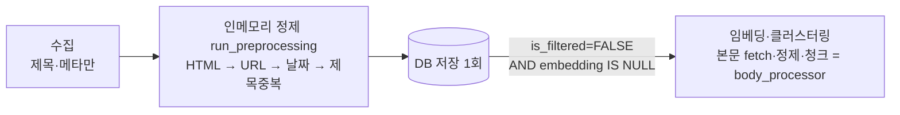
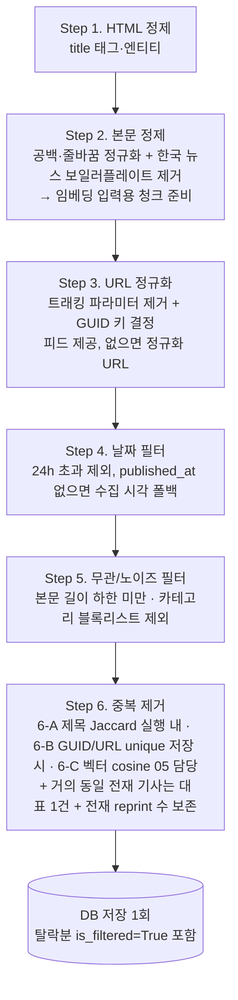

# 전처리 기획서

> **작성자** Kim minkyoung · **작성일** 2026-05-28 (2026-06-12 핵심 압축 개정 · 2026-06-18 재설계 개정)
>
> **범위** 수집 완료 → 전처리 → 임베딩 파이프라인 인계
>
> **핵심 결정**: 수집 결과를 **인메모리 순수 함수**로 정제 후 1회 저장 (원시 저장 후 UPDATE하는 DB 핸드오프 안 씀). 순서: HTML 정제 → 본문 정제(보일러플레이트 제거) → URL 정규화 → 날짜 필터 → 무관/노이즈 필터 → 중복 제거. 본문은 임베딩 입력용으로 정제·청크 준비 후 **처리 후 폐기**(DB 영구저장 금지). 중복 제거는 다층(제목 Jaccard·URL unique·벡터 cosine) + **GUID 키·전재(reprint) 수 보존**. 탈락분은 삭제 대신 `is_filtered=True`. 구현: [`services/preprocessor/news_preprocessor.py`](../../services/preprocessor/news_preprocessor.py)

---

## 목차

- [1. 목적](#1-목적)
- [2. 전처리 파이프라인](#2-전처리-파이프라인)
- [3. 단계별 상세](#3-단계별-상세)
- [4. 전처리 모듈 설계](#4-전처리-모듈-설계)
- [5. 소스별 전처리 적용 매트릭스](#5-소스별-전처리-적용-매트릭스)
- [6. 에러 처리](#6-에러-처리)
- [7. DB 변경 사항](#7-db-변경-사항)
- [8. 구현 로드맵](#8-구현-로드맵)
- [9. 이전 접근 · 검증 이력](#9-이전-접근--검증-이력)

---

## 1. 목적

### 1.1 전처리가 필요한 이유

소스마다 형식·품질이 불균일하다 — HTML 태그(임베딩 품질 저하), 본문 보일러플레이트(기자 서명·저작권 푸터·관련기사·캡션 → 임베딩 노이즈), 타임존 혼용(필터·정렬 오류), 트래킹 파라미터(URL unique 오작동), 중복·전재 기사(임베딩 비용·클러스터 왜곡), 오래된 기사(stale 투입), 무관/노이즈 카테고리.

### 1.2 전처리의 위치 — 수집·전처리·저장을 한 흐름으로

> 재설계: 본문이 파이프라인에 포함되나 **본문 fetch·정제·청크는 임베딩 단계(05) 소속**이다 — 본문은 DB에 저장하지 않고 임베딩 직전에 trafilatura로 fetch하므로(→ [02 §7](./02-news-collection-design.md#7-뉴스-수집-단계)), 수집 시점 전처리(`run_preprocessing`)는 제목·URL·날짜·제목중복만 다룬다. 본문 정제·청크는 별도 순수 함수 `body_processor`가 임베딩 단계에서 호출한다(외부 호출 없는 순수 CPU 연산).

**왜 인메모리인가.** 타임존·URL 정규화를 수집/저장 직전에 끝내면 전처리에 남는 일은 **외부 호출 없는 순수 CPU 연산**이다(본문도 fetch 완료 후 텍스트 정제만). 재시도할 외부 의존성이 없으므로 원시 저장 후 UPDATE(더블 라이트 + 상태 컬럼)는 이득 없이 복잡도만 늘린다 → 수집→전처리→저장을 **한 Airflow Task**로 묶고, DB 핸드오프는 외부 API 의존 단계(임베딩 이후)에만 남긴다.

**임베딩 인계.** 저장 시점 = 전처리 완료이므로 별도 상태 컬럼(`preprocessed_at`) 불필요 — EmbeddingClusterer가 `is_filtered=FALSE AND embedding IS NULL`로 이어받는다. 정제된 본문은 임베딩 입력(제목+본문 청크)을 만든 뒤 **폐기**되므로 DB에 영구저장하지 않는다.

**정규화 시점.** 타임존(KST)은 피드 파싱 시점이 가장 싸므로 **수집 단계**가, 나머지는 저장 직전 인메모리 전처리가 처리한다. URL이 저장 전에 정규화되므로 `ON CONFLICT(url)`이 정확히 동작한다(비정규화 URL 누출 없음).

### 1.3 처리 대상

뉴스(`news`)만 — `title`(정제·저장)과 **본문 텍스트**(정제·청크 준비 후 폐기, 비영구). 공시(`disclosures`)는 DART 공공 데이터라 HTML·타임존 이슈가 없어 전처리 불필요.

---

## 2. 전처리 파이프라인

**정규화 → 필터 → 중복 제거 순서**가 중요하다. 단, 단계는 **두 실행 시점**에 나뉜다 — Step 1·3·4·6-A는 수집 시점 `run_preprocessing`(제목·메타), **Step 2(본문 정제·청크)는 임베딩 단계 `body_processor`**, Step 6-C(cosine)는 임베딩 단계 dedup. 아래 다이어그램은 논리 순서이며 한 함수가 전부 실행한다는 뜻이 아니다.

> 본문(Step 2 산출물)은 임베딩 입력용 청크로만 쓰이고 DB에 영구저장하지 않는다. 제목+본문(청크 mean pooling) 가중평균 결합은 임베딩 단계(05) 책임이며, 본 문서는 "정제·청크 준비"까지만 다룬다.

---

## 3. 단계별 상세

### 3.0 타임존 — 수집 시점 KST 정규화 (전처리 범위 밖)

국내 RSS는 KST(+0900), investing.com은 UTC(+0000) — 수집 단계가 **KST naive datetime**으로 정규화한다(DB 전 테이블 KST naive 통일). 오프셋 없는 시각은 UTC로 가정해 9시간 어긋남을 방지. 구현: `rss_collector._parse_published()` + `utils/dates.to_naive_kst()`.

### Step 1. HTML 정제 (`clean_title`)

`html.unescape` + 태그 제거 정규식, stdlib만 사용. 제목 정제 대상은 `title`. 예: `"<b>삼성전자</b> &amp;..."` → `"삼성전자 &..."`.

### Step 2. 본문 정제 (보일러플레이트 제거 + 청크 준비) — 임베딩 단계

임베딩 직전에 trafilatura로 fetch된 본문 텍스트를 **가벼운 규칙 기반**으로 정제한다(외부 호출 없음, 텍스트는 이미 fetch 완료). 수집 시점 `run_preprocessing`이 아니라 **임베딩 단계가 호출하는 순수 함수**다. 구현: [`services/preprocessor/body_processor.py`](../../services/preprocessor/body_processor.py)(`clean_body`·`chunk_with_overlap`) — 패턴은 [`config/news_body.yaml`](../../config/news_body.yaml), 청크 크기·overlap은 `app/config.py`(`chunk_size`/`chunk_overlap`, bake-off 스윕 대상).

- **공백·줄바꿈 정규화**: 연속 공백·빈 줄 축약.
- **한국 뉴스 보일러플레이트 제거**: 기자 서명, 저작권 푸터(예: "무단전재·재배포 금지"), "관련기사", 이미지 캡션 패턴 제거. **패턴은 설정 파일로 관리**(코드 하드코딩 금지)해 매체 추가 시 코드 변경 없이 확장.
- **청크 준비**: 정제 본문을 인접 overlap 청크로 분할해 임베딩 입력으로 넘긴다. 청크 mean pooling·제목+본문 가중평균 결합은 임베딩 단계(05).

정제 본문은 청크 산출 후 **폐기**한다(DB 영구저장 금지).

### Step 3. URL 정규화 (`remove_tracking_params`) + GUID 키

`utm_*`·`fbclid`·`gclid`·`ref`·`source` 제거 — 같은 기사가 트래킹 파라미터 차이로 다른 행이 되는 것을 차단. 저장 **전** 정규화라 사후 충돌 정리가 필요 없다. 중복 식별 키는 **피드가 제공한 GUID** 우선, 없으면 정규화 URL을 키로 쓴다(GUID가 트래킹·리다이렉트 변형에 더 안정적).

### Step 4. 날짜 필터 (`is_recent`)

수집 시점 기준 **24시간 초과 제외**. `published_at=None`이면 수집 시각(`now`) 폴백 — 방금 수집분은 항상 통과. (09:00 런 = 전일 장 마감 후 기사, 15:30 런 = 당일 장중 기사를 커버.)

### Step 5. 무관/노이즈 필터

분석 가치가 낮은 기사를 제외한다 — **본문 길이 하한 미만**(정제 후 너무 짧아 본문 신호가 없는 단신·링크성 기사), **카테고리 블록리스트**(연예·스포츠 등 무관 카테고리). 임계·블록리스트는 설정으로 관리.

### Step 6. 중복 제거 — 세 레이어 + 전재 카운트

| 레이어 | 방식 | 작동 시점 |
|------|------|------|
| **6-A 제목 유사도** | 제목 bigram **Jaccard ≥ 0.8** — 통신사 받아쓰기(URL 다름) 제거. 같은 실행 내 한정(런 간은 6-C가 처리). 효과 ~20-30% 감소 | 전처리 |
| **6-B GUID/URL unique** | **GUID 우선**, 없으면 정규화 URL — `ON CONFLICT DO NOTHING`으로 이전 런 포함 동일 키 차단 | 저장 |
| **6-C 벡터 유사도** | cosine ≥ 0.95 soft flag — **EmbeddingClusterer 담당** (→ [05 §4.2](./05-embedding-clustering-design.md#42-중복-제거-cosine--095--하드-삭제가-아니라-soft-flag)) | 임베딩 후 |

**전재(reprint) 수 보존**: 거의 동일한 전재 기사(6-A로 묶이는 통신사 받아쓰기 등)는 삭제만 하지 않고 **대표 1건 + 전재 매체 수(reprint count)**를 보존한다 — 보도량(여러 매체가 받아쓴 정도)은 화제성 신호이므로 분석/랭킹에서 활용 가능.

**저장**: 탈락분(날짜·제목 중복·무관 필터)은 삭제하지 않고 `is_filtered=True`로 함께 저장 — "처리됐으나 분석 제외" 표시, 통과율 집계 가능.

---

## 4. 전처리 모듈 설계

`run_preprocessing(records, *, now, threshold_hours=24, dup_threshold=0.8)` — DB 접근 없는 **순수 함수**라 단위 테스트가 쉽다. 수집 노드가 `collect → run_preprocessing → upsert_news`로 조립(→ [02 §7](./02-news-collection-design.md#7-뉴스-수집-단계)).

> **본문 처리는 `run_preprocessing`이 아니다.** 본문은 임베딩 단계에서만 존재하므로 본문 정제·청크는 별도 순수 함수 [`body_processor.py`](../../services/preprocessor/body_processor.py)(`clean_body`·`chunk_with_overlap`)가 맡는다 — `run_preprocessing`은 수집 시점의 제목·URL·날짜·제목중복 전용으로 유지한다. 무관/노이즈 필터·전재 카운트가 더해지면 `run_preprocessing` 시그니처가 바뀔 수 있다. 구현·시그니처 정본: [`news_preprocessor.py`](../../services/preprocessor/news_preprocessor.py).

---

## 5. 소스별 전처리 적용 매트릭스

타임존(수집)·Step 1~6-B 전부 국내 13피드·investing.com 3피드에 **동일 적용** — 소스별 분기 없음. 보일러플레이트 패턴·카테고리 블록리스트만 설정 파일에서 매체별로 누적 관리(코드 분기 없음).

---

## 6. 에러 처리

| 시나리오 | 처리 |
|---------|------|
| 발행일 없음·파싱 실패 | `published_at=None` → 날짜 필터에서 수집 시각 폴백 |
| HTML 정제·URL 정규화 실패 | 원본 유지, 계속 진행 |
| 본문 fetch 실패·빈 본문 | 본문 정제 생략 → 제목만으로 진행(임베딩 입력은 제목 중심), 무관 필터의 길이 하한에 걸리면 `is_filtered=True` |
| 보일러플레이트 패턴 미매치 | 본문 원본 유지, 계속 진행(패턴은 best-effort) |
| 필터·중복 탈락 | 삭제 안 함, `is_filtered=True`로 저장 |
| 키 충돌 | GUID/URL `ON CONFLICT DO NOTHING` |
| DB 저장 실패 | 롤백 → 다음 수집 런에서 재수집·재처리 |

---

## 7. DB 변경 사항

저장 시 채워지는 전처리 관련 컬럼: `title`·`url`(정제·정규화된 값), `is_filtered`(탈락 표시), GUID 키, 전재 수(reprint count).

- `is_filtered`(전처리 제외)와 `is_analyzed`(분석 완료)는 의미가 달라 분리 — 통과율 집계 시 의미 오염 방지.
- **정제 본문은 컬럼에 영구저장하지 않는다** — 임베딩 입력(청크) 산출 후 폐기. 저장 대상은 정제 본문에서 파생된 임베딩뿐.
- GUID·전재 수 컬럼 추가 여부와 마이그레이션은 ORM/`queries.py`와 함께 별도 처리(재설계 후속).
- **`preprocessed_at` 컬럼은 제거 완료**(2026-06-11 마이그레이션 c6fd3e4b6185) — 인메모리 전환으로 항상 NULL인 죽은 컬럼이었다.

---

## 8. 구현 로드맵

| 단계 | 내용 | 상태 |
|------|------|------|
| 1 | `run_preprocessing` (인메모리, 제목·URL·날짜·제목중복) | 완료 (구 설계) |
| 2 | 단위 테스트 (`tests/test_news_preprocessor.py`) | 완료 (구 설계, 본문·신규 단계분 보강 필요) |
| 3 | 수집 노드 조립 (`news_collector.py`) | 완료 (구 설계) |
| 4 | `preprocessed_at` 제거 마이그레이션 | 완료 (2026-06-11) |
| 5 | 본문 정제(보일러플레이트 제거) + 패턴 설정 파일 | 완료 (2026-06-19, `body_processor.clean_body` + `config/news_body.yaml`) |
| 6 | 임베딩 입력용 본문 청크 준비(인접 overlap) | 완료 (2026-06-19, `body_processor.chunk_with_overlap`, 문자 기반 baseline) |
| 7 | 무관/노이즈 필터(본문 길이 하한·카테고리 블록리스트) | 재구현 필요 |
| 8 | GUID 키 강화 + 전재(reprint) 수 보존 | 재구현 필요 |
| 9 | `run_preprocessing` 시그니처 갱신 + 단위 테스트 보강 | 재구현 필요 |

---

## 9. 이전 접근 · 검증 이력

검증을 거쳐 운영했던 **구 설계**를 기록한다(재설계로 일부 결정이 바뀌었으나, 마이그레이션 사실은 지우지 않는다).

| 항목 | 구 설계 (검증·운영됨) | 신규 (2026-06-18 재설계) | 변경 이유 |
|------|------|------|------|
| 본문 | **본문 미저장, `title`만 정제** | 본문을 trafilatura로 fetch → **본문 정제(보일러플레이트 제거)·임베딩 입력용 청크 준비** 후 폐기 | 제목만으로는 임베딩 신호가 빈약 → 본문 청크를 임베딩 입력에 결합(05) |
| 단계 수 | **인메모리 4단계**(HTML → URL → 날짜 → 제목중복) | 6단계(본문 정제·무관 필터 추가) | 본문 노이즈 제거·저품질 기사 사전 배제 필요 |
| 중복 키 | URL unique 중심 | **GUID 우선 키** + 전재(reprint) 수 보존 | 트래킹/리다이렉트 변형에 GUID가 더 안정적, 보도량을 화제성 신호로 활용 |
| `preprocessed_at` | **제거 완료**(2026-06-11, c6fd3e4b6185) — 인메모리 전환으로 항상 NULL인 죽은 컬럼 | 그대로 미사용(복원 안 함) | 저장 시점 = 전처리 완료라는 전제는 재설계에서도 유효 |

**유지되는 핵심 결정**: 수집→전처리→저장을 한 흐름(인메모리)으로 묶는 구조, 탈락분 `is_filtered=True` 보존, 임베딩 인계(`is_filtered=FALSE AND embedding IS NULL`), 본문 텍스트 정제는 외부 호출 없는 순수 CPU 연산이라는 전제(본문은 fetch 후 정제). 본문 fetch 자체는 수집/임베딩 단계 책임으로, 전처리는 fetch된 텍스트 정제만 담당한다.
