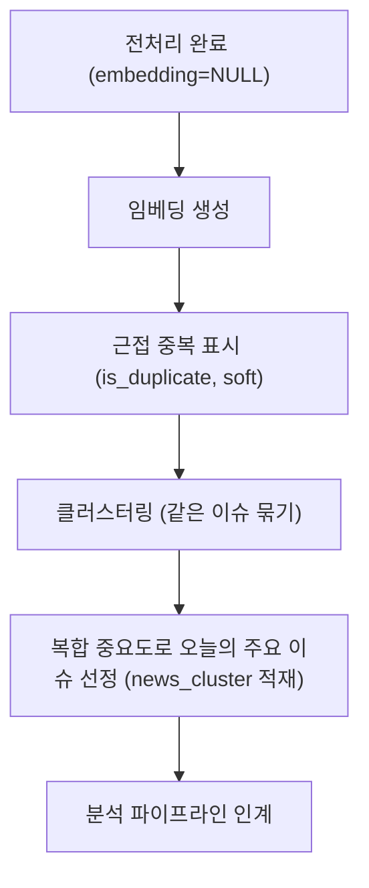
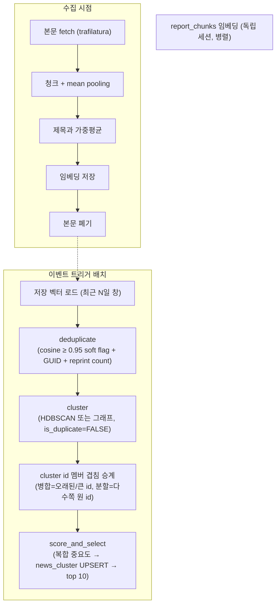

# 임베딩·클러스터링 기획서

> **작성자** Kim minkyoung · **작성일** 2026-05-28 (2026-06-12 핵심 압축 개정 · 2026-06-18 재설계 개정 · 2026-06-19 설계 리뷰 보강)
>
> **범위** 전처리 완료 → 임베딩 생성 → 클러스터링 → 분석 파이프라인 인계
>
> **핵심 결정(2026-06-18 재설계)**: 입력 **제목 벡터 + 본문 청크 mean pooling을 가중평균**(α·제목+(1−α)·내용, bake-off 동안 α=제목0.3/내용0.7 고정) · 임베딩 모델 **bake-off로 결정**(후보 bge-m3 / multilingual-e5-large / gemini-embedding-001 / 베이스라인 ko-sroberta, **다국어 한·영 필수**) · 중복 cosine≥0.95 soft-flag + GUID 키 + **전재 수(reprint count) 보존** · 클러스터링 **HDBSCAN vs 그래프(연결요소+재귀분할) bake-off로 결정**(주지표 쌍별 F1) · 운영 **최근 N일 윈도우 이벤트 기반(임베딩 완료 트리거) 재클러스터링 + cluster id 멤버 겹침 승계** · 복합 중요도 → top 10 → `news_cluster` UPSERT. 본문은 수집/임베딩 시점에 trafilatura로 fetch 후 즉시 폐기(DB 영구저장 금지). **입력 방식·평가 전제가 바뀌어 임베딩/클러스터링은 재구현·재검증 대상.**
>
> **관련 문서**: [01 오케스트레이션](./01-pipeline-orchestration-design.md) · [04 전처리](./04-preprocessing-design.md) · [임베딩 모델 평가 보고서](../evaluation/00-embedding-model-evaluation.md)

---

## 목차

- [1. 목적](#1-목적)
- [2. 임베딩 전략](#2-임베딩-전략)
- [3. pgvector 인덱스 설정](#3-pgvector-인덱스-설정)
- [4. 유사도 기반 중복 제거](#4-유사도-기반-중복-제거)
- [5. 클러스터링 알고리즘 비교 및 선택](#5-클러스터링-알고리즘-비교-및-선택)
- [임베딩 모델·클러스터링 bake-off (E1~E7)](#임베딩-모델클러스터링-bake-off-e1e7)
- [6. 주요 이슈 선정 — 복합 중요도 스코어](#6-주요-이슈-선정--복합-중요도-스코어)
- [7. RAG 소스 준비 — ReportChunk 임베딩](#7-rag-소스-준비--reportchunk-임베딩)
- [8. EmbeddingClusterer 설계](#8-embeddingclusterer-설계)
- [9. 임베딩 텍스트 정책 — 테이블별](#9-임베딩-텍스트-정책--테이블별)
- [10. 구현 로드맵](#10-구현-로드맵)
- [11. 미결 사항](#11-미결-사항)
- [이전 접근 · 검증 이력](#이전-접근--검증-이력)

---

## 1. 목적



임베딩 용도는 세 가지다.

1. 유사 중복 제거 — 대표 1건만 분석한다.
2. 클러스터링 — Issue Docent 기반.
3. RAG 검색 — 기업 컨텍스트.

**처리 대상**: `news`(`is_filtered=FALSE AND embedding IS NULL`) · `report_chunks`(`embedding IS NULL`, 전처리 불필요).

---

## 2. 임베딩 전략

### 2.1 임베딩 모델 — bake-off로 결정 (재설계)

**기존 `gemini-embedding-001` 단독 확정을 철회하고 bake-off로 재선정한다.** 임베딩 입력이 title 단독 → 제목+본문 청크 가중평균으로 바뀌어(§2.2) 기존 3축 평가의 전제(title 단독)가 더 이상 성립하지 않고, **다국어(한·영)가 필수 요건으로 추가**됐기 때문이다(나스닥·S&P500 등 영어 기사를 같은 임베딩 공간에서 묶어야 함).

후보:

| 후보 | 성격 | bake-off 이유 |
|------|------|--------------|
| **bge-m3** | 장문맥·다국어 | 본문 통째/긴 청크에 강함, 한·영 동시 |
| **multilingual-e5-large** | 단문맥·다국어 | 청크+평균 운영에 적합, `passage:`/`query:` 규약 |
| **gemini-embedding-001** | API(Vertex) | 기존 3축 1위, MRL 768, 인프라 통일 |
| ko-sroberta-multitask | 베이스라인 | 기준선(2021, 한국어 단독) |

선정 절차·지표·의사결정 규칙은 [임베딩 모델·클러스터링 bake-off (E1~E7)](#임베딩-모델클러스터링-bake-off-e1e7) 절이 단일 출처. **다국어·교차언어 작동을 1차 게이트**로 두고, 통과 모델 중 골드셋 **쌍별 F1**로 정렬한다. **차원은 선정 모델에 종속**(gemini 선정 시 MRL 768로 현 `Vector(768)` 스키마 유지 가능, bge-m3 1024/e5 1024 선정 시 전 테이블 동시 마이그레이션 필요).

> 기존 gemini 채택 표(ari 0.307 / silhouette 0.443 / recall@5 0.931, 3축 1위)와 근거는 [이전 접근 · 검증 이력](#이전-접근--검증-이력)에 보존한다. 평가 교훈은 유효: **모델별 호출 규약(task_type/instruction/프리픽스) 검증 필수.**

환경 변수: `EMBED_MODEL`·`EMBED_DIM`은 **bake-off 확정 후 설정**(차원은 선정 모델 종속).

### 2.2 임베딩 텍스트 구성 — 제목 + 본문 청크 가중평균 (재설계)

**채택: 제목 벡터와 본문 벡터의 가중평균.** 본문은 수집/임베딩 시점에 trafilatura로 전체 fetch한 뒤(§4 본문 처리), **청크 분할 → 각 청크 임베딩 → mean pooling으로 단일 본문 벡터**를 만든다. 인접 청크는 **overlap**으로 문맥을 보존한다. 최종 입력 벡터:

```text
v = α · v_title + (1 − α) · v_body_mean      (L2 정규화 후 결합)
```

bake-off 동안 **α = 제목 0.3 / 내용 0.7로 고정**한다. 청크 단위·크기·overlap은 **선정 모델의 토큰 한계에 종속**이라 모델 확정 후 결정한다.

> 기존 실험2(2026-06-11)는 **본문을 통째로 연결**한 title vs title+body 비교라(silhouette 0.495→0.443 하락), 신규의 **청크+mean pooling+가중평균**과는 조건이 다르다. 따라서 기존 결론을 그대로 적용하지 않고, 신규는 [bake-off (E1~E7)](#임베딩-모델클러스터링-bake-off-e1e7)에서 새 조건으로 재검증한다. 기존 title 단독 채택 근거와 실험2 수치는 [이전 접근 · 검증 이력](#이전-접근--검증-이력)에 보존한다.

저작권·프라이버시 제약(→ [02 §3](./02-news-collection-design.md#3-저작권-및-법적-검토)): 본문·snippet은 **DB 영구저장 금지** — 수집/임베딩 시점에 메모리에서 fetch·청킹·임베딩 후 **즉시 폐기**만 가능하다.

### 2.3 배치 처리

Vertex AI 한도에 맞춰 `EMBED_BATCH_SIZE=50`씩 분할 호출. 일별 추정 ~38~60회(200~500종목 기준). 구현: [`embedding_client.py`](../../services/embedder/embedding_client.py) — 모델명 기반 백엔드 분기(Vertex/genai/HF), task_type 반영, lazy 생성.

---

## 3. pgvector 인덱스 설정

HNSW(`m=16, ef_construction=64`, cosine)를 `news`·`report_chunks`에 — ANN으로 O(log n) 유사도 검색. **벡터가 쌓이기 전 생성**한다(누적 후 빌드는 오래 걸림). 적용 완료(마이그레이션 52b04bf7383d).

---

## 4. 유사도 기반 중복 제거

### 4.0 본문 fetch·폐기 (재설계)

임베딩 입력(§2.2)에 본문이 필요하므로, 수집/임베딩 시점에 **trafilatura로 전체 기사 본문을 fetch**해 청킹·임베딩에만 사용하고 **즉시 폐기**한다. 본문 원문은 **DB에 영구 저장하지 않는다**(저작권·프라이버시, → [02 §3](./02-news-collection-design.md#3-저작권-및-법적-검토)). 임베딩은 **수집 시점에 미리 추론·저장**해 두므로 이벤트 트리거 클러스터링(§5)은 저장된 벡터만 읽는다.

### 4.1 두 가지 임계값

| 목적 | 임계값 | 의미 |
|------|--------|------|
| 중복 제거 | cosine ≥ 0.95 | 거의 동일한 기사 (받아쓰기/전재) |
| 이슈 클러스터링 | (§5 알고리즘 기반) | 같은 이슈를 다룬 다른 기사 |

### 4.2 중복 제거 (cosine ≥ 0.95) — 하드 삭제가 아니라 soft flag

중복 판정 기사는 **삭제하지 않고 `is_duplicate=TRUE`로 표시**한다. 같은 쌍 중 **발행 시각(없으면 수집 시각)이 늦은 쪽**을 표시하고 이른 쪽을 대표로 남긴다 — RSS는 발행순 전달이 보장되지 않아 id 순서를 쓰지 않고, `COALESCE(published_at, created_at)` + id 타이브레이크로 전순서를 보장한다. 클러스터링·분석은 `is_duplicate=FALSE`만 읽는다.

판정 보강(재설계): cosine≥0.95 soft flag에 더해 ① 기존 **제목 Jaccard** 유지 ② **GUID 키 강화**(RSS GUID 동일 시 동일 기사로 결합, URL/리다이렉트 변형 방어) ③ **전재 매체 수(reprint count) 보존** — 같은 사건을 받아쓴 매체 수를 대표 행에 카운트로 남긴다. 전재 수는 **화제성 신호**(여러 매체가 동시에 받아씀)라 중복 제거로 버리지 않고 중요도 스코어(§6)에서 활용할 수 있다.

**왜 삭제하지 않나**: 하드 DELETE는 ① `news_cluster` FK 정합성 위협 ② URL 유니크 행 제거로 재수집→재임베딩 비용 재발 ③ "무엇이 중복으로 빠졌는지" 추적 차단. soft flag는 셋을 모두 피하고 상태 컬럼 기반 핸드오프와 일관되며, 재실행 멱등하다.

**대상 창**: `settings.pipeline_window_hours`(KST) 기준 cutoff를 **파이썬에서 계산해 전달**한다(`created_at`이 KST naive라 SQL `NOW()`(UTC)와 직접 비교하면 9시간 어긋남). 구현: [`deduplicator.py`](../../services/preprocessor/deduplicator.py).

---

## 5. 클러스터링 알고리즘 비교 및 선택

### 5.1~5.2 HDBSCAN vs 그래프 — bake-off로 결정 (재설계)

**기존 HDBSCAN 단독 확정을 철회하고, HDBSCAN과 그래프 방식을 동일 골드셋의 쌍별 F1로 실측 비교해 결정한다.** 입력 임베딩이 바뀌어(§2.2) 기존 채택 전제가 달라졌고, 임계값 그룹핑을 기각한 근거였던 **전이성 문제(A≈B, B≈C → A,C 묶임)는 휴리스틱 추정이었으므로 데이터로 직접 확인**한다.

| 알고리즘 | 비교 포인트 |
|---------|----------|
| K-Means | 클러스터 수 사전 지정 필요 — 오늘 이슈가 몇 개인지 모름(기각 유지) |
| Agglomerative | O(n² log n) 속도(기각 유지) |
| **HDBSCAN (후보)** | 수 지정 불필요 · noise 자동 분리 · 파라미터 1개 · varying density(금리 50건 vs 단독 2건) 동시 처리 |
| **그래프 방식 (후보)** | cosine 유사도 임계치 초과 쌍을 엣지로 → **연결요소(connected components)가 클러스터**. 단순·해석 용이, 임계치 1개 |

**그래프 방식 상세**: cosine 유사도가 임계치를 넘는 기사 쌍을 엣지로 두고, 그래프의 **연결요소**를 하나의 클러스터로 본다. 전이성으로 인한 **거대 클러스터(크기 > S, 예 100)는 재귀 분할**한다 — 해당 서브그래프에 **임계치를 상향(증가폭 +0.05) 재적용**해 다시 연결요소를 구한다. 정지 조건: 크기 ≤ S / 재귀 상한 도달 / 분할해도 멤버 불변. 임계치·S·증가폭은 휴리스틱 초기값(→ §11).

> 전이성 우려·varying density·싱글톤 보존 등 기존 HDBSCAN 채택 근거는 [이전 접근 · 검증 이력](#이전-접근--검증-이력)에 보존한다.

구현(공통): [`cluster.py`](../../services/embedder/cluster.py) — precomputed cosine distance, 거리 음수 클리핑.

### 5.1a 운영 — 이벤트 기반(임베딩 완료 트리거) 윈도우 재클러스터링 + cluster id 승계 (재설계)

- **트리거**: **이벤트 기반(임베딩 완료 트리거)**. 고정 cron 없이, 임베딩 Task가 Airflow 3 Asset/Dataset을 produce하면 데이터 인식 스케줄로 클러스터링 DAG가 트리거된다. 수집 시점에 미리 추론·저장된 임베딩 벡터만 읽으므로 임베딩 추론 비용이 트리거마다 들지 않는다.
- **왜 1분 배치가 아니라 이벤트 기반인가**: 수집·임베딩이 시장 세션 기반(하루 4회)이라 세션 사이엔 클러스터링 입력(저장 벡터)이 안 바뀐다 → 동일 입력에 1분마다 재계산하면 동일 결과만 반복하는 낭비다. 이벤트 기반은 주기가 수집 주기에 자동 정합하고, 나중에 속보 티어 고빈도 수집을 더하면 자동으로 더 자주 트리거된다.
- **윈도우**: 클러스터링 대상은 **최근 N일 시간 윈도우 전체**(초기 **N=14일**). 트리거 시 윈도우 내 전체를 재클러스터링한다. N은 운영 데이터로 확정(→ §11).
- **(선택) 저빈도 재스코어 틱**: importance 시간 감쇠가 필요하면 클러스터링과 별개로 저빈도 재스코어 틱(예 1시간)만 둔다 — 묶음(클러스터)은 그대로, 순위(importance)만 갱신.
- **cluster id 멤버 겹침 승계**: 재클러스터링은 클러스터 구성을 바꿀 수 있으므로, 신규 클러스터를 직전 결과와 **멤버 겹침(overlap) 기준**으로 매칭해 id를 승계한다.
  - **병합**: 둘 이상 기존 클러스터가 하나로 합쳐지면 **더 오래된(또는 더 큰) id를 유지**.
  - **분할**: 한 클러스터가 여럿으로 갈라지면 **다수 멤버를 가진 쪽이 원래 id를 승계**, 나머지는 신규 id 발급.
  - **윈도우 eviction(id drifting 방어)**: 멤버가 N일 창 밖으로 빠지면 클러스터의 다수 구성이 바뀌어, 재계산이 없어도 id가 분열·병합되는 **id drifting**이 생길 수 있다(병합·분할 규칙만으로는 끝자락 이탈을 못 막는다). 방어 — ① 매칭 기준을 "현재 창에 살아 있는 멤버 겹침"으로 한정해 evict된 멤버가 매칭 표를 흔들지 않게 하고, ② 한 번 다운스트림(news_cluster·분석)에 노출된 id는 멤버가 창 밖으로 전부 빠지기 전까지 **소멸시키지 않고 보존**한다(잔여 멤버 1건이라도 있으면 id 유지). 전체 재계산은 단순성·자기보상이 장점이라 유지하되, 운영에서 drifting이 잦으면 **확정 코어 freeze + 신규만 증분 할당**을 비교 후보로 검토한다(→ §11).
  - 안정적 id로 다운스트림(news_cluster·분석)이 같은 이슈를 추적할 수 있게 한다.

### 5.3 임계값 도출 방법론

**현재 수치(0.95, mcs=2, ms=1)는 초기 추정값**이다. 실데이터 교정 절차는 다음과 같다.

1. 같은/다른 이슈 쌍을 50쌍씩 수동 라벨링한다.
2. cosine 분포를 시각화한다 — valley는 클러스터링 임계값, positive 90th pct는 중복 임계값(분리가 안 되면 P-R 곡선의 F1 최대점).
3. 사람이 좋다고 평가한 결과의 silhouette을 합격 기준으로 역산한다(금융 뉴스는 0.2~0.35도 현실적).
4. 환경 변수에 반영한다.

상류 FilterChain `confidence`의 의미 검증(구간별 사람 평가)도 별도 가치가 있다.

### 5.4 Singleton 처리 — 기본 보존

HDBSCAN의 noise(-1)는 "주제 무관"이 아니라 **"오늘 한 곳만 보도한 단독 기사"**다 — 코퍼스가 이미 2중 정제(증권 RSS + 전처리)됐기 때문. 단독 보도는 오히려 잠재 고가치이므로 버리지 않고 **size-1 클러스터로 승격**(`promote_singletons`)해 동일 기준으로 importance를 경쟁시킨다. 우선순위는 `TOP_ISSUE_COUNT` 컷오프가 결정 — 임의 임계값 없이 스코어가 정렬한다.

### 5.5 클러스터링 품질 검증

자동 지표 `evaluate_clustering`: silhouette(noise 제외, cosine)·davies_bouldin·n_clusters·noise_ratio. 정성 체크: 같은 이슈가 같은 클러스터인가 / 다른 이슈가 분리되는가 / singleton이 합리적인가 / 20건 초과 클러스터 재검토 / noise 50%↑면 mcs 축소.

### 5.6 파라미터 선정 — 알고리즘 종속

HDBSCAN 선정 시 **초기값 `mcs=2, ms=1`**(2개 이상 언론사 보도 시 클러스터 형성, noise 최소) — 두 파라미터는 상호작용하므로 2D 그리드 스윕으로 교정한다(noise>60% → 둘 다↓ / 거대 클러스터 쏠림 → ms↑ / 과분할 → mcs↑). 그래프 방식 선정 시 핵심 파라미터는 **엣지 임계치 · 재귀 분할 기준 S · 증가폭(+0.05)**이다(§5.1~5.2). 어느 쪽이든 bake-off에서 임계치를 **모델별로 스윕**한다(cosine 스케일이 모델마다 다름, → E2).

### 5.7 차원 축소 — 불필요

768차원은 HNSW로 충분(일별 ~수백 건, 거리행렬 ~14MB). 1024 모델 전환 + 성능 문제 시에만 PCA 먼저, 부족하면 UMAP.

### 5.8 대표 기사 선정 — 1건 + 중심 근접순 후보

대표는 **1건**(`representative_news_id` = member[0])이되, `member_news_ids`를 **클러스터 중심 근접순으로 정렬 저장**(`order_by_centrality`) — 스키마 변경 없이 ① 대표 1건 ② fetch 실패 시 다음 후보 fallback ③ 다관점 후보를 모두 커버. 대표 3건 분석은 토큰·fetch 3배 + 중복 서술 위험이라 기각.

환경 변수(재설계): `DEDUP_SIMILARITY_THRESHOLD=0.95` 유지 · 클러스터링 윈도우는 **최근 N일**(`CLUSTER_WINDOW_DAYS`, 초기 14) · 트리거는 고정 cron이 아니라 **Asset 트리거**(임베딩 완료 시 데이터 인식 스케줄, 고정 interval 변수 없음) · 알고리즘별 파라미터(HDBSCAN `mcs/ms` 또는 그래프 임계치·S·증가폭)는 **bake-off 확정 후 설정**. α(`EMBED_TITLE_WEIGHT=0.3`)는 bake-off 동안 고정.

---

## 임베딩 모델·클러스터링 bake-off (E1~E7)

입력 방식·다국어 요건이 바뀌어 임베딩 모델(§2.1)과 클러스터링 알고리즘(§5.1~5.2)을 같은 골드셋으로 동시 재선정한다. 이 절이 선정 절차의 단일 출처다.

> **일정 리스크 — 변수 폭발 방어**: 모델 4종 × 알고리즘 2종 × 모델별 임계치 스윕을 한꺼번에 도는 그리드는 크리티컬 패스(차원·청크·마이그레이션이 전부 후행)를 막을 수 있다. 그리드를 **직렬 게이트로 축소**한다 — ① 1차: 다국어·교차언어 게이트(E6-1)로 모델 후보를 먼저 컷, ② 2차: 생존 모델로만 알고리즘 비교(재귀 분할은 E4대로 제외), ③ 3차: 확정 모델·알고리즘에서만 파라미터 스윕. 각 게이트에 타임박스를 두고, 게이트를 못 넘으면 베이스라인(gemini-embedding-001 + HDBSCAN, 구 설계)로 폴백해 다운스트림 블로킹을 푼다.

### E1. 골드셋 구축

- **연속 기간 전수 수집 300~500건**(무작위 추출 금지) — 같은 사건 군집이 실제 분포대로 나타나야 클러스터링을 정직하게 평가할 수 있다.
- **한:영 = 7:3**, 교차언어(같은 사건의 한국어·영어 기사) 쌍 포함 — 다국어·교차언어 작동을 검증하기 위함.
- **단일 사건(event) 기준 라벨링** — "같은 사건을 보도했는가"가 같은 클러스터 여부의 기준.
- **난이도 태그**: 전재중복 / 같은이슈-다른해석 / 혼동쌍(유사하지만 다른 사건) / 교차언어.
- **단일 라벨러 + 가이드라인 + 사후 검수**로 일관성 확보.

### E2. 변수 통제

- 모델은 **자연 운영 방식**으로 평가: 장문맥 모델(bge-m3)은 본문 통째, 단문맥 모델(e5)은 청크+mean pooling. 다른 변수는 고정.
- **임계치는 모델별로 스윕**한다 — cosine 스케일이 모델마다 달라 단일 임계치 비교는 불공정하다.

### E3. 임베딩 생성

- 모델 **권장 사용법 준수**: e5는 `passage:`/`query:` 프리픽스, gemini는 task_type 등.
- 모든 벡터 **L2 정규화** 후 결합·비교.
- 제목·본문 가중평균 **α = 제목 0.3 / 내용 0.7로 고정**(§2.2).

### E4. 클러스터링 실행

- cosine 유사도 → 임계치 그래프 → 연결요소로 클러스터를 만든다.
- **bake-off에서는 HDBSCAN과 그래프 방식 둘 다** 동일 골드셋으로 비교한다.
- **재귀 분할(§5.1~5.2)은 알고리즘 비교 단계에서 제외**하고, 모델·알고리즘을 확정한 뒤에 적용한다(비교 공정성·단순성).

### E5. 평가 지표

- **주지표: 쌍별 F1** — Precision(서로 다른 사건을 잘못 묶지 않음)과 Recall(같은 사건을 놓치지 않음)의 균형.
- 보조: ARI · NMI · Homogeneity / Completeness.
- 운영 지표: 차원 · 지연(latency) · 처리량 · 메모리 · API 비용 · **본문 외부 전송 여부**(프라이버시).
- **다국어 분리 평가**: 한국어 / 영어 / 교차언어를 각각 측정.

### E6. 의사결정 규칙 (사전식 lexicographic)

1. **다국어·교차언어 작동 게이트** — 한·영·교차언어가 기본적으로 작동하지 않으면 탈락.
2. 게이트 통과 모델·알고리즘을 **쌍별 F1로 정렬**.
3. **ΔF1 ≤ 0.02로 막상막하**면 운영성(지연·처리량·메모리)·프라이버시(본문 외부 전송)·비용으로 최종 결정.

### E7. 재현성

- 실험을 **스크립트화**하고 모델·라이브러리 **버전·시드를 고정**.
- 골드셋을 보관하고, bake-off 결과는 **별도 리포트 문서**로 남긴다(이 기획서와 분리).

---

## 6. 주요 이슈 선정 — 복합 중요도 스코어

클러스터 단위 평가라 임베딩·클러스터링 후에만 가능 — 본 절이 신호·가중치·구현의 단일 출처.

### 6.0 선정 방법론 — 벤치마크와 중요도 신호

벤치마크: **카카오 RUBICS**(Volume — 클러스터 크기 상위 = 주요 이슈), **Bloomberg**(Velocity — 기사 급증 시 상단). 신호 5종 중 Volume·Velocity·Sentiment·Entity는 MVP, Social(구글 트렌드)은 확장.

> 재설계: §4.2의 **전재 수(reprint count)**는 volume(클러스터 크기)과 별개의 **화제성 신호**(같은 사건을 여러 매체가 동시에 받아씀)로, 중요도 스코어에 보조 신호로 추가 가능하다(도입 여부는 데이터 검증 후, → §11).
>
> **가중치 W는 학술 단일 출처 없는 휴리스틱 초기값** — 실데이터 교정 전까지 확정값이 아니다(→ §11).

### 6.1 스코어 계산

각 신호를 [0,1] 정규화 후 가중합 — `W = {volume: 0.4, velocity: 0.3, sentiment: 0.15, entity: 0.15}`.

- `volume_n` = 크기 / 당일 최대 크기
- `velocity_n` = 이전 대비 증가율 [0,1] 클리핑. **prev=0(이전 관측 없음)이면 0** — 원안의 `(size-prev)/(prev+1)`은 prev=0에서 전부 1이 되는 결함이 있어 교정(2026-06-11).
- sentiment·entity는 상류(NER·감성) 연결 전까지 0 (MVP, → §11) — 현재는 볼륨 지배 정렬(RUBICS와 정합).

구현: [`score.py`](../../services/embedder/score.py).

### 6.2 상위 이슈 선정·영속화

`persist_clusters`: 클러스터당 1행을 `news_cluster`에 **(run_date, representative_news_id) 기준 UPSERT** — 재실행은 멱등하고, 오후(15:30) 런에서 같은 클러스터가 새 기사로 크면 소속·크기·중요도를 **갱신**한다(DO UPDATE). importance 내림차순 상위 `TOP_ISSUE_COUNT=10` 대표 id를 반환해 분석에 인계.

---

## 7. RAG 소스 준비 — ReportChunk 임베딩

`report_chunks`의 `embedding IS NULL` 청크를 같은 단계에서 임베딩(`ReportEmbedder`, task_type=RETRIEVAL_DOCUMENT) — 분석 단계 ImpactAnalysisChain의 기업 컨텍스트 소스.

### 7.2 기업 컨텍스트 검색

`app/llm/rag.py`의 `get_company_context(db, company, k=3)` — 쿼리를 RETRIEVAL_QUERY로 임베딩해 pgvector `<=>`(cosine)로 상위 k 청크 검색(비대칭 임베딩). langchain PGVector 의존성 없이 raw pgvector + ORM으로 구현(중복 제거와 방식 일관). 매칭 없으면 빈 문자열 → 호출부가 "확실치 않음" 처리(RAG 엣지케이스 → 06).

---

## 8. EmbeddingClusterer 설계

### 8.1~8.3 구성과 실행

재설계 흐름(임베딩은 수집 시점에 미리 추론·저장, 클러스터링은 이벤트 트리거 배치로 분리):



- State(XCom 보고): `news_embedded`/`chunks_embedded`/`duplicates_removed`/`clusters_formed`/`top_issues`/`errors`.
- **시간 윈도우(최근 N일)는 run()에서 1회 계산**해 dedup·클러스터링에 같은 값 전달(창 불일치 방지).
- 임베딩 한쪽 실패는 errors에 담고 나머지 단계 진행(부분 실패 격리). AsyncSession은 동시 사용 불가라 병렬 임베딩은 각자 독립 세션.
- 클라이언트 lazy 생성 — 작업 0건 런은 백엔드 구축 비용 0.

구현: [`embedding_clusterer.py`](../../services/pipeline/embedding_clusterer.py). 재구현 필요 — 알고리즘·모델 bake-off 확정(E1~E7) 및 이벤트 트리거 배치·cluster id 승계를 반영한 뒤 재검증한다. 기존 실완주 수치(2026-06-11: 임베딩 778+91 → 중복 92 → 클러스터 190 → top 10, errors 0, 멱등성 PASS)는 **구 설계(title 단독·HDBSCAN·당일 창)** 기록으로 [이전 접근 · 검증 이력](#이전-접근--검증-이력)에 보존한다.

> 남은 상태 머신 조각: `is_analyzed=TRUE` 마감은 **분석 단계(06)**가 담당 — 06 연결 전까지 게이트는 열려 있고, 시간 윈도우(최근 N일)가 재클러스터링 범위를 한정한다.

---

## 9. 임베딩 텍스트 정책 — 테이블별

| 테이블 | 임베딩 텍스트 | task_type | 이유 |
|--------|------------|------|------|
| `news` | 제목 + 본문 청크 가중평균(α·제목+(1−α)·내용, 본문=청크 mean pooling) | (모델 종속) | 제목·본문 모두 활용, 본문은 fetch 후 폐기(§2.2) |
| `report_chunks` | `content` 전체 | RETRIEVAL_DOCUMENT | RAG 검색 정확도 우선 |
| `disclosures` | `f"{title}. {content[:500]}"` | (분석 단계 구현 시) | 공시 제목 + 본문 앞부분 |

---

## 10. 구현 로드맵

| 단계 | 내용 | 상태 |
|:---:|------|:---:|
| 1~2 | pgvector 활성화 + HNSW 인덱스 | 완료 |
| B | 임베딩 모델·클러스터링 bake-off(E1~E7) | 재설계 신규 |
| 3 | 본문 fetch(trafilatura)+청크 mean pooling+제목 가중평균 임베딩 | 재구현 필요 (구 `news_embedder.py` title 단독은 구 설계) |
| 4 | `deduplicator.py` (soft flag + GUID + reprint count) | 재구현 필요 (cosine≥0.95 soft flag는 구 설계 완료, GUID·reprint 추가) |
| 5 | 클러스터링(HDBSCAN vs 그래프 확정)+최근 N일 이벤트 트리거 배치+cluster id 승계 | 재구현 필요 (구 `cluster.py` HDBSCAN+당일 창은 구 설계) |
| 6 | `report_embedder.py` (RAG 청크) | 완료 (뉴스 재설계 무관, 유지) |
| 7 | `app/llm/rag.py` (기업 컨텍스트 검색) | 완료 (뉴스 재설계 무관, 유지) |
| 8 | `EmbeddingClusterer` 조립 | 재구현 필요 (구 설계 완료, 2026-06-11 실완주·멱등 검증) |
| 9 | 통합 테스트 (분석 연결 후 재검증) | 재검증 필요 (구 설계 1차 완료) |

---

## 11. 미결 사항

| 항목 | 내용 | 상태 |
|------|------|------|
| 임베딩 모델 | bake-off(bge-m3/e5/gemini/baseline)로 선정, 다국어 필수 (E1~E7) | bake-off 실행으로 확정 |
| 클러스터링 알고리즘 | HDBSCAN vs 그래프 — 쌍별 F1로 결정 (E1~E7) | bake-off 실행으로 확정 |
| 청크 파라미터 | 청크 크기·overlap (선정 모델 토큰 한계 종속) | 모델 확정 후 데이터/실행으로 확정 |
| 클러스터링 임계치 | cosine 임계치·재귀 분할 S·증가폭(+0.05) 또는 HDBSCAN (mcs, ms) | 모델별 스윕으로 데이터 확정 |
| 시간 윈도우 N | 초기 14일 — 운영값 | 운영 데이터로 확정 |
| cluster id drifting | 윈도우 eviction 시 id 분열·병합 빈도 측정 → 잦으면 확정 코어 freeze + 신규 증분 할당을 전체 재계산의 비교 후보로 (§5.1a) | 운영 데이터로 판단 |
| 저빈도 재스코어 틱 | importance 시간 감쇠용 저빈도 재스코어 틱(예 1시간) 도입 여부 (§5.1a) — 묶음은 그대로, 순위만 갱신 | 데이터 검증 후 |
| α(제목/내용 가중치) | bake-off 동안 0.3/0.7 고정 → 운영값 | 데이터/실행으로 확정 |
| 전재 수(reprint) 신호 | 중요도 스코어 보조 신호 도입 여부 (§6.0) | 데이터 검증 후 |
| 가중치 W 교정 | 0.4/0.3/0.15/0.15 휴리스틱 → 실데이터 튜닝 | 데이터 누적 후 |
| Sentiment·Entity·Social 신호 | LLM/FinBERT 감성, NER 연동(06), 구글 트렌드 | 06 구현 시·MVP 이후 |
| `prev_cluster_size` 추적 | velocity 계산용 이전 크기 저장 방법 | 신호 통합 시 |
| TOP_ISSUE_COUNT | 상위 10개 적정성 | 서비스 기획 조율 |
| 임베딩 도구 수준 retry | 현재 Airflow retries가 1차 방어 — with_retry 보강 | 06 구현 시 |

---

## 이전 접근 · 검증 이력

2026-06-18 재설계로 대체된 기존 검증 결과를 보존한다. 절대 수치·근거는 후속 bake-off 비교 기준으로 재사용한다.

### 임베딩 모델 — gemini-embedding-001 3축 평가 (2026-06-09 확정, 철회)

후보 최대 12종을 실데이터 3축(비지도·라벨 클러스터링·RAG)으로 평가, 전체 기록은 [평가 보고서](../evaluation/00-embedding-model-evaluation.md)가 단일 출처.

| 모델 | ari | silhouette | RAG recall@5 | 판정 |
|------|-----|-----------|--------------|------|
| **gemini-embedding-001 (구 채택)** | **0.307** | **0.443** | **0.931** | 세 축 모두 1위 |
| KURE-v1 (1024) | 0.227 | 0.364 | 0.862 | 근소 열위 + 1024 마이그레이션 비용 |
| ko-sroberta (baseline) | 0.213 | 0.337 | 0.690 | 2021 모델, 기준선 |

구 채택 근거: ① 파이프라인 직결 지표(ari·recall) 단독 1위 ② MRL 768 절단으로 현 `Vector(768)` 스키마 유지 ③ Vertex로 LLM 분석과 인프라 통일. **철회 사유**: 임베딩 입력이 title 단독 → 제목+본문 청크 가중평균으로 바뀌고(§2.2) 다국어(한·영)가 필수 요건이 되어 평가 전제가 달라졌다(§2.1·E1~E7).

### 임베딩 텍스트 — title 단독 + 실험2 (2026-06-11 확정, 철회)

구 채택: **title 단독**(`build_embed_text`). 주식 뉴스 제목은 키워드 밀도가 높아 동일 이슈를 묶기에 충분하다고 봤다.

> **실험2(2026-06-11)**: title vs **title+body(본문 통째 연결)** 비교(185건) — 본문 추가 시 **silhouette 0.495→0.443으로 하락**, 군집 ARI 0.407. 본문 통째 연결은 클러스터링을 개선하지 않았고, feed summary 결합(중간안)도 불채택.

**철회 사유**: 신규는 본문을 **청크+mean pooling+제목 가중평균**으로 쓰므로 실험2의 '본문 통째 연결'과 조건이 달라, 같은 결론을 적용하지 않고 새 조건에서 재검증한다(§2.2·E4).

### 클러스터링 — HDBSCAN 단독 확정 (철회)

구 채택 근거: 클러스터 수 지정 불필요 · noise 자동 분리 · 파라미터 1개 · varying density(금리 50건 vs 단독 2건) 동시 처리. **임계값 그룹핑은 전이성 문제(A≈B, B≈C → A,C 묶임)로 기각**했고, noise(-1)는 단독 보도로 보아 **size-1 클러스터로 승격(싱글톤 보존)**했다. 초기값 `mcs=2, ms=1`.

구 실완주 검증(2026-06-11): 임베딩 778+91 → 중복 92 → 클러스터 190 → top 10, errors 0. 멱등성 2회 연속 실행 PASS(2회차 신규 적재 0).

**철회 사유**: 임베딩 입력이 바뀌어 전제가 달라졌고, 전이성 우려는 휴리스틱 추정이었으므로 **그래프 방식과 함께 골드셋 쌍별 F1로 데이터로 직접 비교**한다(§5.1~5.2·E1~E7).

---

## 참고 자료

- [임베딩 모델 평가 보고서](../evaluation/00-embedding-model-evaluation.md) — 모델 3축 평가 단일 출처(구 설계 및 신규 bake-off 비교 기준선)
- [01 파이프라인 오케스트레이션](./01-pipeline-orchestration-design.md) · [02 뉴스 수집](./02-news-collection-design.md) · [04 전처리](./04-preprocessing-design.md)
- 카카오 RUBICS(Volume), Bloomberg(Velocity) — 중요도 신호 벤치마크(§6.0)
